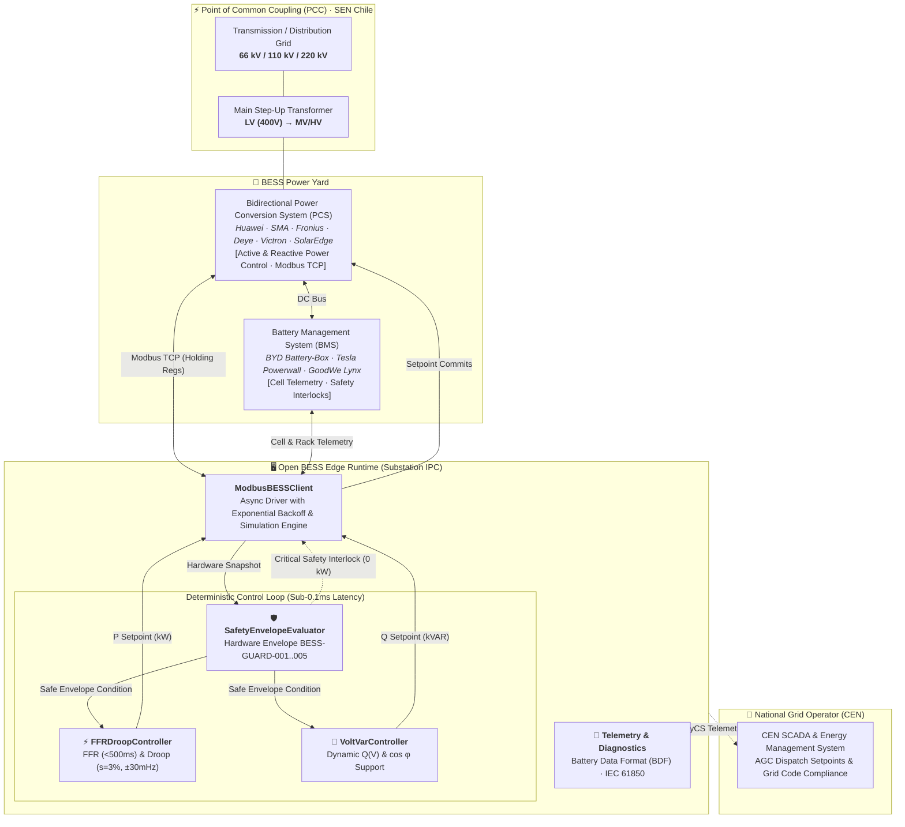
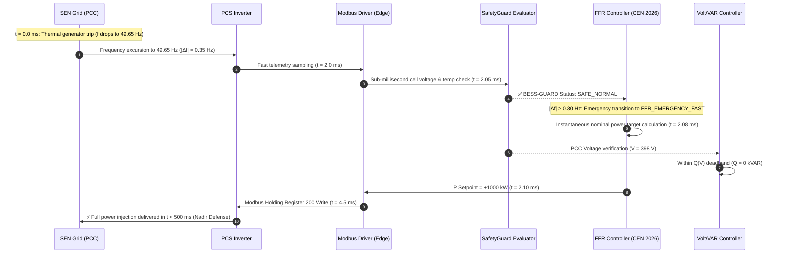
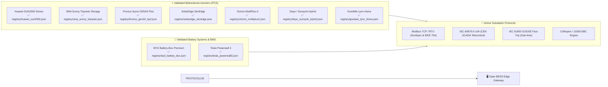

# ⚡ Open BESS Edge

<div align="center">

[](https://opensource.org/licenses/Apache-2.0)
[](https://www.python.org/)
[-2ea44f?logo=lightning&logoColor=white)](https://www.cne.cl/)
[](https://www.coordinador.cl/)
[](#-benchmarking--closed-loop-latency)
[](#-industrial-deployment)
[](#-hardware-safety-envelope-bess-guard)
[-brightgreen?logo=pytest&logoColor=white)](#-automated-testing--cen-compliance-suite)

**Mission-Critical Industrial Edge Gateway & Frequency Response Controller for Battery Energy Storage Systems (BESS)**  
*Deterministic substation edge computing platform for strict compliance with the Chilean National Electric System (SEN) Grid Code.*

[Architecture](#-substation-architecture) •
[CEN Grid Code](#-grid-code-compliance-cen-cfydr-2026) •
[BESS-GUARD Safety](#-hardware-safety-envelope-bess-guard) •
[Volt/VAR Q(V)](#-dynamic-voltvar-support-qv) •
[Hardware Ecosystem](#-supported-hardware-ecosystem) •
[Quick Start](#-quick-start)

</div>

---

## 🏗️ Substation Architecture

Open BESS Edge operates at the **OT (Operational Technology)** layer inside substation-hardened Industrial PCs (Edge IPC). It enforces real-time grid dynamic response during disturbances and autonomously protects battery assets.



---

## ⏱️ Real-Time Closed-Loop Sequence (Severe Contingency)

Millisecond-by-millisecond execution trace during a massive generation trip on the SEN (loss of 397 MW):



---

## ⚡ Grid Code Compliance (CEN CFyDR 2026)

The edge controller parameters are calibrated against the official **Frequency Control & Reserve Determination Study (CFyDR 2026) by the Coordinador Eléctrico Nacional (CEN)** and the **NTSyCS Technical Grid Code (Res. CNE N° 343)**:

```text
                                 DROOP & FFR CHARACTERISTIC CURVE (CEN 2026)
        Discharge (+P)
              ▲
      P_nom ──┤                                            ┌─────────── Severe Contingency FFR (|Δf| ≥ 0.30 Hz)
              │                                           /              Ramp Released: Sub-500ms Full Injection
              │                                          /
              │                  Primary Droop Zone     /
              │                       (s = 3%)         /
              │                   (K_p = P_nom/s*f)   ┌
              │                                      /│
              │                                     / │
        0 kW ─┼──────────────────────────────┬─────┴──┼────────────────────────► Frequency (Hz)
              │                              │        │
              │                     49.70 Hz │        │ 49.97 Hz   50.00 Hz
              │                (FFR Trigger) │        │ (Deadband Boundary)
              │                              │        │
              │                              │        └─ CEN Official Primary Deadband: ±30 mHz
              │                              │
     -P_nom ──┤                              └─ Automatic Load Shedding: If P < 0, immediately cut to 0 kW
              ▼
         Charge (-P)
```

| Parameter | Grid Code Reference | Open BESS Edge Specification |
|---|---|---|
| **Nominal Frequency** | NTSyCS Art. 3-1 | $f_0 = 50.00\text{ Hz}$ |
| **Primary Deadband** | CEN CFyDR 2026 Study | $\Delta f_{deadband} = \pm 0.03\text{ Hz}$ ($\pm 30\text{ mHz}$) eliminating stochastic noise cycling |
| **Permanent Droop ($s$)** | Res. CNE N° 343 / NTSyCS | Configurable $s \in [0.02, 0.05]$ (Default: $s = 0.03$ / 3%) |
| **FFR Contingency Threshold**| CEN CFyDR 2026 Study | $|\Delta f| \ge 0.30\text{ Hz}$ ($f \le 49.70\text{ Hz}$ or $f \ge 50.30\text{ Hz}$) |
| **FFR Response Time** | NTSyCS Chapter 3 | Full power injection delivered in $t < 500\text{ ms}$ for Nadir support |
| **Normal Ramp Limit** | NTSyCS Art. 3-15 | Automated quasi-steady-state ramp clamp $\le 20\% P_{nom}/\text{min}$ |
| **Immediate Load Relief** | CFyDR 2026 Methodology | Instantaneous shedding to $0\text{ kW}$ if BESS was charging during an event |
| **CEN Performance Audit** | Formal Homologation | Deterministic measurement and reporting of $Aporte_{@10s}$ and $Aporte_{@2min}$ |

---

## 🔄 Dynamic Volt/VAR Support: $Q(V)$

In compliance with **NTSyCS Chapter 3 (Art. 3-21)**, all BESS facilities connected to the SEN must supply dynamic reactive power support at the PCC:

* **Automated $Q(V)$ Curve**: Capacitive reactive injection ($+Q$) when $V < 0.98\text{ pu}$; inductive reactive absorption ($-Q$) when $V > 1.02\text{ pu}$.
* **Constant $\cos\phi(P)$**: Smooth power factor control between $0.95$ inductive and $0.95$ capacitive.
* **Direct $Q$ Dispatch**: Centralized setpoints received from the system coordinator.

---

## 🛡️ Hardware Safety Envelope (BESS-GUARD)

Deterministic sub-millisecond safety interlocks engineered for **LFP 314Ah** utility-scale cells under **NFPA 855** and **SEC RIC N° 01/02**:

| Guard Code | Fault Description | Physical Boundary (LFP 314Ah) | Automated Edge Action |
|:---:|---|:---:|---|
| **`BESS-GUARD-001`** | **Cell Undervoltage** | $V_{cell,min} < 2.50\text{ V}$ | Discharge interlock & DC breaker trip |
| **`BESS-GUARD-002`** | **Cell Overvoltage** | $V_{cell,max} > 3.65\text{ V}$ | Charge interlock & PCS halt |
| **`BESS-GUARD-003`** | **Cell Overtemperature** | $T_{cell,max} > 50.0\text{ °C}$ | Emergency shutdown & maximum HVAC boost |
| **`BESS-GUARD-004`** | **DC Isolation Fault** | $R_{iso} < 500.0\text{ k}\Omega$ | Inverter trip & isolation alert dispatch |
| **`BESS-GUARD-005`** | **Cell Imbalance Warning**| $\Delta V_{cell} > 50.0\text{ mV}$ | Active balancing alert & preventive derating |

---

## 🔌 Supported Hardware Ecosystem
### Production-Validated Modbus Profiles (`registry/`)

The following hardware models feature verified Modbus register mappings, telemetry decoders, and compliance tests in the [`registry/`](registry/) directory:



### 🎯 Hardware Integration Roadmap (Q4-2026 / 2027)

> [!NOTE]
> In strict compliance with our **Zero Mock Data** policy and engineering transparency, the following utility-scale devices are part of our ongoing hardware qualification roadmap. Their register maps are in laboratory testing prior to release in `registry/`:
>
> - **Utility-Scale Inverters (PCS)**: Sungrow (SC/ST Series), Kehua Tech (SPI Series), Ingeteam (Ingecon Sun Storage), Power Electronics (HEM Series).
> - **Utility-Scale Battery Racks & BMS**: CATL (EnerOne / EnerC 314Ah), Gotion High-Tech (314Ah), EVE Energy (LF560K / LF314Ah).

---

## 🚀 Quick Start

### 1. Installation

```bash
git clone https://github.com/bess-solutions/open-bess-edge.git
cd open-bess-edge

# Create virtual environment
python -m venv .venv
source .venv/bin/activate       # On Windows: .venv\Scripts\activate

# Install in editable mode with development dependencies
pip install -e .[dev]
```

### 2. Run the Official CEN Compliance Test Suite

```bash
pytest tests/ -v
```

### 3. Run the Node in Deterministic Simulation Mode

```bash
python -m src.edge_node
```

---

## 🐳 Industrial Deployment (Docker / Substation IPC)

```bash
docker build -t bess-solutions/open-bess-edge:2.0.0 .

docker run -d \
  --name open-bess-edge \
  --restart always \
  --network host \
  -v $(pwd)/config/edge_config.yaml:/app/config/edge_config.yaml:ro \
  bess-solutions/open-bess-edge:2.0.0
```

---

## 🤖 Infrastructure & AI Architectural Assistance

<div align="center">

[-2496ED?logo=docker&logoColor=white)](https://docs.docker.com/ai/docker-agent/)
[](.devcontainer/devcontainer.json)
[-green?logo=docker&logoColor=white)](Dockerfile.hardened)

</div>

This project incorporates container infrastructure hardening, reproducible DevContainers, and unprivileged IEC 62443 security profiles developed with assistance from **Docker AI Assistant (Gordon)**, complemented by grid control engineering and SEN Chile market calibration by **Antigravity (Google DeepMind)**. See [CONTRIBUTORS.md](CONTRIBUTORS.md) for full attribution.

---

## 📄 License & Governance

Distributed under the **Apache 2.0** License. See [LICENSE](LICENSE) for details.
