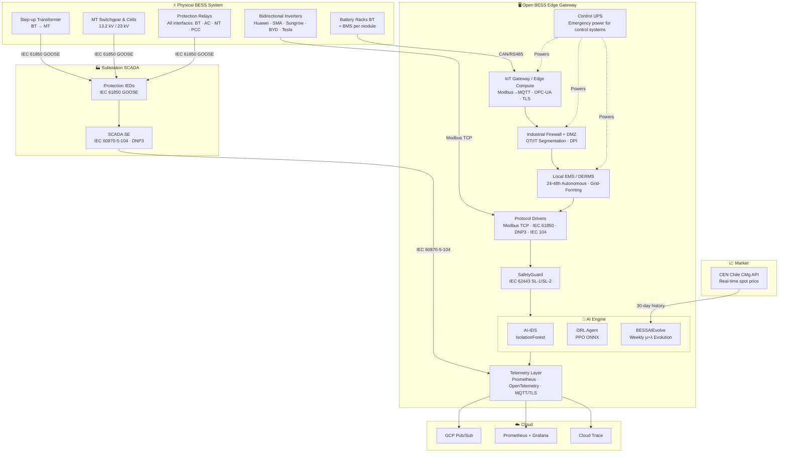
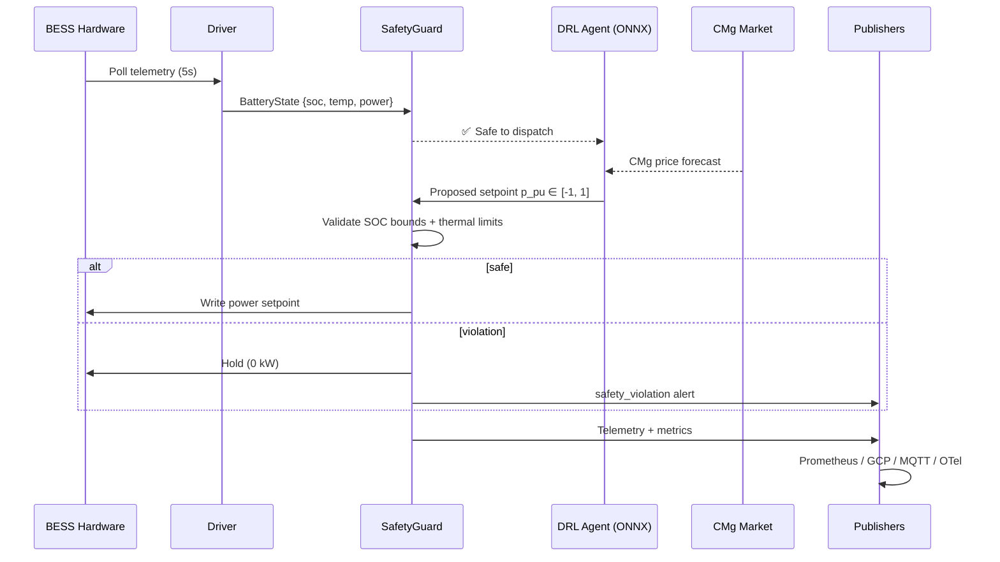
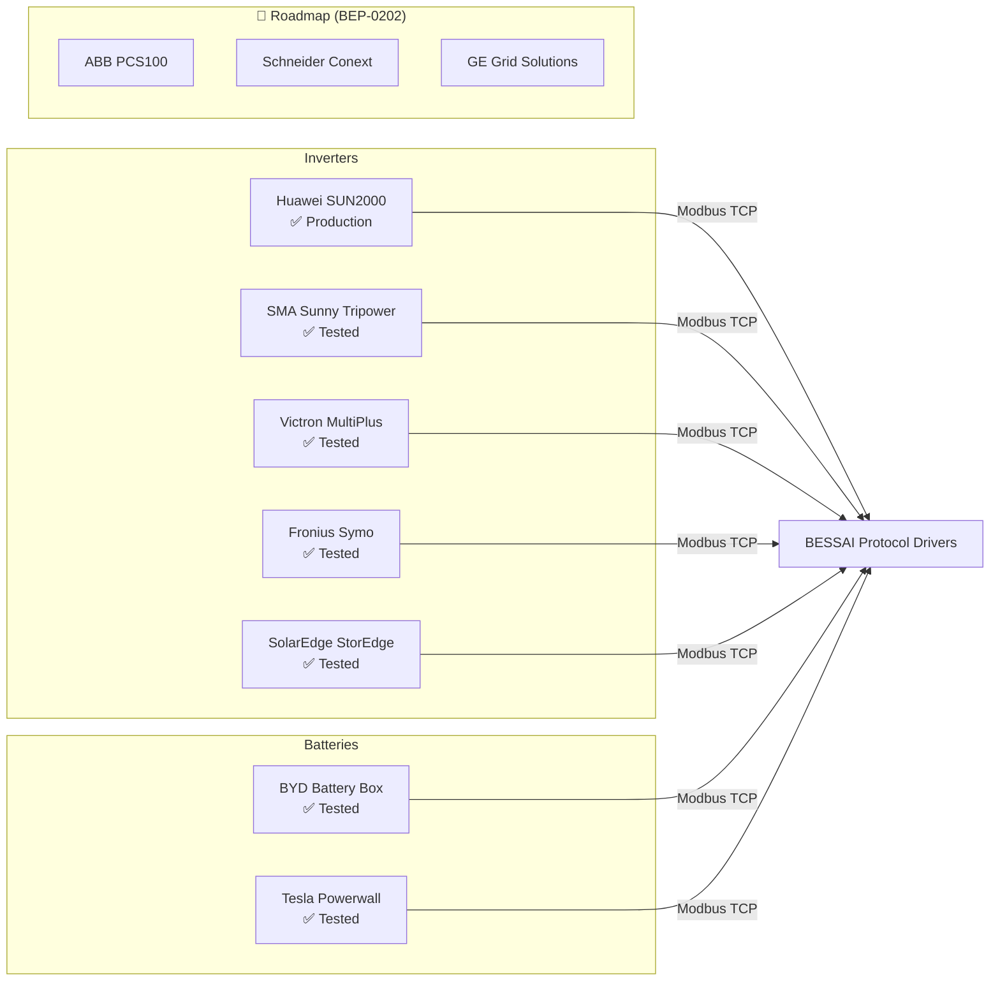

<div align="center">

# 🔋 BESSAI Edge Gateway

**Industrial-grade open-source edge gateway for secure, AI-optimized Battery Energy Storage System (BESS) management.**

*Self-evolving arbitrage intelligence · IEC 62443 SL-1→SL-3 · IEC 61850 · DNP3 · IEC 60870-5-104 · IEEE 1547-2018 IBR/GFM · NTSyCS Chile*

[](https://opensource.org/licenses/Apache-2.0)
[](https://www.python.org/)
[](https://github.com/bess-solutions/open-bess-edge/actions)
[](https://ghcr.io/bess-solutions/open-bess-edge)
[](docs/compliance/iec62443_mapping.md)
[](docs/compliance/ieee1547_mapping.md)
[](docs/compliance/ntscys_compliance.md)
[](tests/)
[](.)

[**Leer en Español 🇪🇸**](README.md) · [**Documentation**](https://bess-solutions.github.io/open-bess-edge) · [**Quick Start**](#-quick-start) · [**MCP Server**](docs/mcp_server.md) · [**BEP Proposals**](docs/bep/BEP-0001.md) · [**Roadmap**](#-roadmap)

</div>

---

## What is BESSAI Edge Gateway?

BESSAI is a production-ready edge computing platform that sits between your Battery Energy Storage System (BESS) hardware and cloud/SCADA infrastructure. It handles:

- **Real-time telemetry** collection from inverters and BMS (Modbus TCP, IEC 61850, DNP3, IEC 60870-5-104).
- **AI-powered dispatch** decisions via a Deep Reinforcement Learning (DRL) arbitrage agent (ONNX inference, no cloud connection required for local execution).
- **Autonomous self-improvement** via BESSAIEvolve — an evolutionary parameter search weekly cycle.
- **Safety enforcement** with IEC 62443 SL-1/SL-2 compliant guardrails (SafetyGuard).
- **Multi-cloud publishing** to GCP Pub/Sub, MQTT, and OpenTelemetry.
- **Full system architecture integration**: from BT battery racks, bidirectional inverters, step-up transformers, MT cells, protection relays, plant SCADA, substation SCADA, to industrial firewalls.

> **Reference deployment:** 200kWh / 100kW Huawei SUN2000 BESS, Santiago Chile — arbitraging the Chilean SEN spot market (CMg) in production since 2025.

---

## 🏗️ Architecture



---

## 📊 Data Flow



---

## 🔌 Hardware Registry



---

## 🔌 Model Context Protocol (MCP) Server

Open BESS Edge features a native Python-based **MCP Server** that exposes key operational tools to AI assistants (such as Claude Desktop or custom agents). This enables managing and querying BESS status in natural language with strict adherence to our Zero Mock Data Policy.

### Exposed Tools
* **`get_battery_health`**: Read real-time telemetry (SOC, voltage, active/reactive power, temperatures) over Modbus TCP.
* **`diagnose_faults`**: Inspect active alarms and status registers for fault-decoding.
* **`predict_rul`**: Forecast Remaining Useful Life (RUL) using Arrhenius thermal-stress kinetics over [training_dataset.parquet](data/training_dataset.parquet).
* **`cyber_hygiene_check`**: Audit host OS hardening parameters (SSH, TLS, rules).

### Claude Desktop Configuration
Add the server config to your `claude_desktop_config.json`:
```json
{
  "mcpServers": {
    "open-bess-edge": {
      "command": "python",
      "args": [
        "C:/Users/lenovo/OneDrive/Desktop/02_Proyectos_Tech/01_BESS_Tech/open-bess-edge/mcp_server/server.py"
      ],
      "env": {
        "PYTHONPATH": "C:/Users/lenovo/OneDrive/Desktop/02_Proyectos_Tech/01_BESS_Tech/open-bess-edge"
      }
    }
  }
}
```

---

## ⚡ Quick Start

### 0. Interactive Setup (Recommended)

```bash
git clone https://github.com/bess-solutions/open-bess-edge.git
cd open-bess-edge
bash scripts/setup.sh   # interactive site config generation
```

### 1. Local (Python)

```bash
make dev                  # install dependencies + setup pre-commit hooks
bash scripts/setup.sh     # generate config/.env
make simulate             # run with integrated BESS simulator
make health               # verify all local components are active
```

### 2. Docker Compose (Recommended Deployment)

```bash
git clone https://github.com/bess-solutions/open-bess-edge.git
cd open-bess-edge
bash scripts/setup.sh     # generate config/.env
docker compose -f infrastructure/docker/docker-compose.yml --profile simulator --profile monitoring up -d
```

Grafana → http://localhost:3000 (Credentials: check `GF_SECURITY_ADMIN_PASSWORD` in `config/.env`)  
Metrics → http://localhost:8000/metrics  
Health  → http://localhost:8000/health

---

## ✨ Features

| Feature | Description | BEP |
|---|---|---|
| **Multi-protocol drivers** | Modbus TCP, IEC 61850, IEEE 2030.5 / SEP 2.0 | BEP-0100 |
| **Hardware profiles** | Certified profiles (Huawei, SMA, Victron, BYD, Tesla…) | – |
| **SafetyGuard** | SOC/thermal/power bounds — blocks unsafe commands | – |
| **AI-IDS** | Real-time anomaly detection (IsolationForest + z-score) | – |
| **DRL Arbitrage Agent** | PPO + 8 Chilean Node ONNX models — local execution | BEP-0200 |
| **BESSAIEvolve** | Parameter self-improvement weekly evolutionary cycle | BEP-0303 |
| **VPP Fleet Manager** | Multi-site Virtual Power Plant manager | BEP-0500 |
| **OpenTelemetry** | Distributed traces + metrics to GCP / Datadog / Grafana | – |
| **IEC 62443 SL-1/2** | Full cybersecurity control mapping — SL-2 compliant | – |
| **DNP3** | Utility / substation SCADA telecontrol driver | `DNP3Driver` |
| **IEC 60870-5-104** | Substation SCADA telecontrol for Chilean CEN | `IEC104Driver` |
| **IEEE 1547-2018 (IBR/GFM)** | Grid-Forming + anti-islanding + LVRT/HVRT | `FrequencyResponseAgent` |

---

## 🛡️ Compliance

| Standard | Status | Evidence |
|---|---|---|
| IEC 62443 SL-1 | ✅ Compliant | [iec62443_mapping.md](docs/compliance/iec62443_mapping.md) |
| IEC 62443 SL-2 | ✅ Compliant | `SL2SecurityGate` — RBAC + HMAC-SHA256 |
| NTSyCS Cap. 4.2 | ✅ GAP-001 | Ramp rate ≤10%/min (`SafetyGuard`) |
| NTSyCS Cap. 4.3 | ✅ GAP-002 | PFR droop < 2s (`FrequencyResponseAgent`) |
| NTSyCS Cap. 4.4 | ✅ GAP-011 | Q/V droop (`ReactiveController`) |
| NTSyCS Cap. 6.1 | ✅ GAP-003 | mTLS telemetry to CEN (`CENPublisher`) |
| NTSyCS Cap. 6.2 | ✅ GAP-004 | SCADA IEC 60870-5-104 (`IEC104Driver`) |
| Decreto 88/2023 | ✅ GAP-007 | Anti-arbitrage PMGD (`PMGDComplianceEngine`) |
| Ley 21.663/2024 | ✅ | Cyber incident notification CSIRT ≤3h (`SecurityNotifier`) |
| IEEE 2030.5 / SEP 2.0 | ✅ 10 endpoints | [BEP-0100](docs/bep/BEP-0100.md) |
