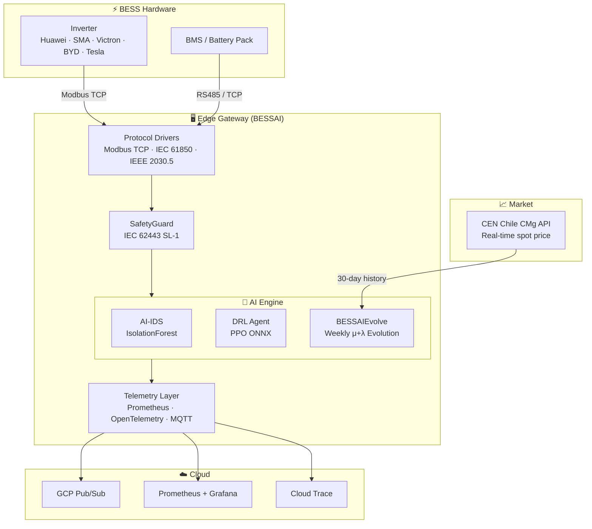
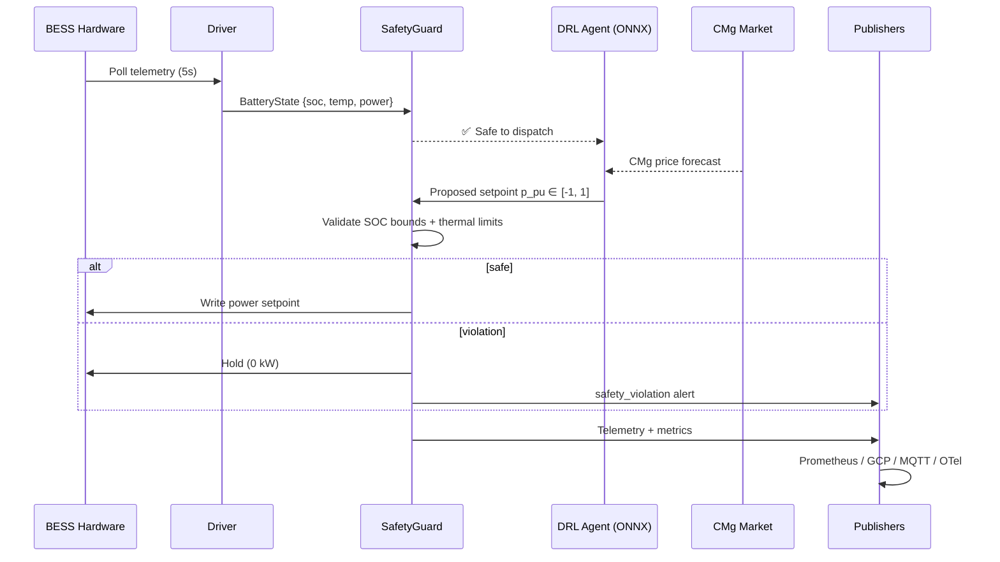
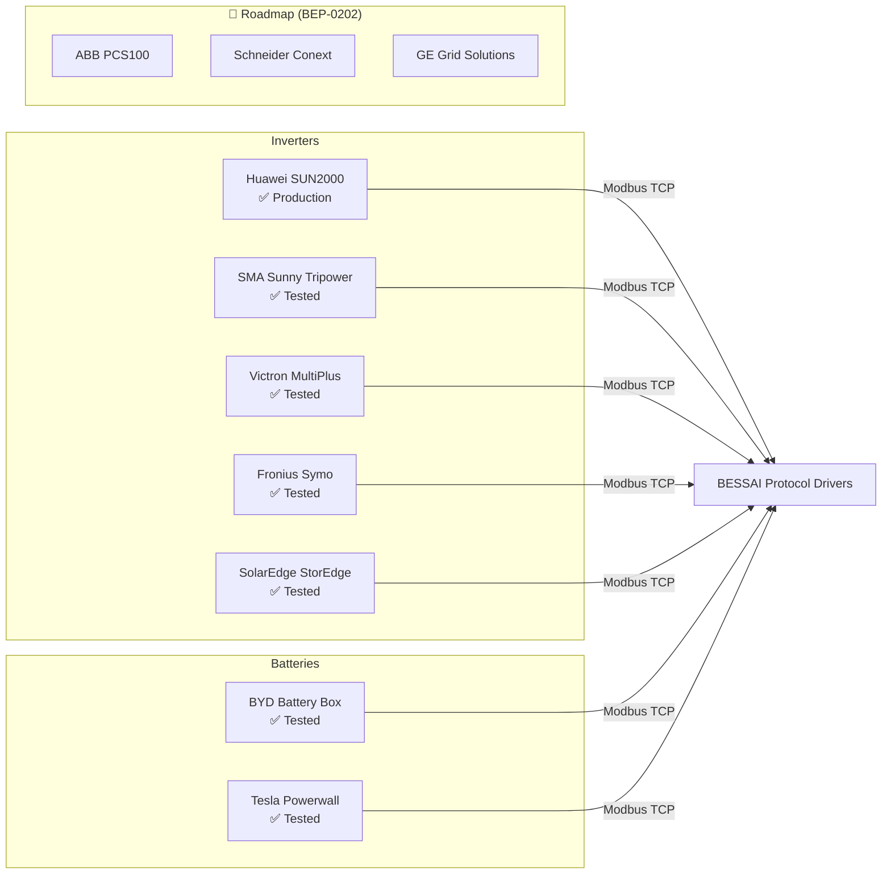

<div align="center">

# 🔋 BESSAI Edge Gateway

**Industrial-grade open-source edge gateway for secure, AI-optimized Battery Energy Storage System (BESS) management.**

*Self-evolving arbitrage intelligence · IEC 62443 · IEC 61850 · IEEE 2030.5 · NTSyCS Chile*

[](https://opensource.org/licenses/Apache-2.0)
[](https://www.python.org/)
[](https://github.com/bess-solutions/open-bess-edge/actions)
[](https://codecov.io/gh/bess-solutions/open-bess-edge)
[](https://ghcr.io/bess-solutions/open-bess-edge)
[](https://scorecard.dev/viewer/?uri=github.com/bess-solutions/open-bess-edge)
[](docs/compliance/iec62443_mapping.md)
[](docs/compliance/ntscys_compliance.md)
[](docs/specs/)
[](docs/bep/BEP-0001.md)
[](SECURITY.md)

[**Documentation**](https://bess-solutions.github.io/open-bess-edge) · [**Quick Start**](#-quick-start) · [**Discord**](https://discord.gg/ZqpE8AZs) · [**BEP Proposals**](docs/bep/BEP-0001.md) · [**Roadmap**](#-roadmap)

</div>

---

## What is BESSAI Edge Gateway?

BESSAI is a production-ready edge computing platform that sits between your Battery Energy Storage System hardware and cloud infrastructure. It handles:

- **Real-time telemetry** collection from inverters and BMS (Modbus TCP, IEC 61850, IEEE 2030.5)
- **AI-powered dispatch** decisions via a DRL arbitrage agent (ONNX inference, no cloud required)
- **Autonomous self-improvement** via BESSAIEvolve — an AlphaEvolve-inspired weekly evolution loop
- **Safety enforcement** with IEC 62443 SL-1 compliant guardrails
- **Multi-cloud publishing** to GCP Pub/Sub, MQTT, OpenTelemetry

> **Reference deployment:** 200kWh / 100kW Huawei SUN2000 BESS, Santiago Chile — arbitraging the Chilean SEN spot market (CMg) in production since 2025.

---

## 🏗️ Architecture



---

## 📊 Data Flow



---

## 🔌 Hardware Registry



---

## 📸 Visuals

> **Note to contributors:** the screenshots/GIFs below are placeholders. We welcome PRs that add real captures.  
> See [docs/CONTRIBUTING_MEDIA.md](docs/CONTRIBUTING_MEDIA.md) for recording guidelines.

| # | What to capture | Tool | Priority |
|---|---|---|---|
| 1 | `docker compose up` boot sequence — all services healthy | asciinema | 🔴 High |
| 2 | Grafana dashboard: SOC curve + CMg price overlay | Screen recording → GIF | 🔴 High |
| 3 | `make simulate` running with live telemetry output | asciinema | 🟡 Medium |
| 4 | BESSAIEvolve GitHub Actions run + auto-PR creation | Screenshot | 🟡 Medium |
| 5 | Raspberry Pi 4 running BESSAI (`htop` + `make health`) | Photo + terminal | 🟢 Nice |
| 6 | IEEE 2030.5 DERControl endpoint responding to curl | asciinema | 🟢 Nice |

---

## 🤝 Para Early Adopters

> ¿Quieres desplegar BESSAI en una instalación real?

| Quiero... | Recurso |
|-----------|---------|
| 🗺️ Elegir mi camino de adopción | [**ADOPTER_HUB.md**](docs/ADOPTER_HUB.md) |
| ⚡ Demo en 5 min (sin hardware) | [tutorials/quickstart_5min.md](docs/tutorials/quickstart_5min.md) |
| 📅 Roadmap Día 0 → Producción | [ONBOARDING_7DAYS.md](docs/ONBOARDING_7DAYS.md) |
| ❓ FAQ técnica (hw, mercados, licencia) | [FAQ.md](docs/FAQ.md) |
| 🛡️ Programa Early Adopters (soporte prioritario) | [early_adopters.md](docs/early_adopters.md) |
| 🆘 Soporte durante el onboarding | [Abrir issue](https://github.com/bess-solutions/open-bess-edge/issues/new?template=adopter_support.yml) |

---

## ⚡ Quick Start

### 1. Local (Python)

```bash
git clone https://github.com/bess-solutions/open-bess-edge.git
cd open-bess-edge
make dev                  # install all deps + pre-commit hooks
cp .env.example .env      # edit with your BESS IP + credentials
make simulate             # run with built-in hardware simulator
make health               # verify all subsystems are up
```

### 2. Docker Compose (recommended)

```bash
git clone https://github.com/bess-solutions/open-bess-edge.git
cd open-bess-edge
cp .env.example .env
docker compose up -d                        # core gateway
docker compose --profile monitoring up -d  # + Prometheus + Grafana
```

Grafana → http://localhost:3000 (admin / bessai)  
Metrics → http://localhost:8000/metrics  
Health  → http://localhost:8000/health

### 3. Raspberry Pi 4 / 5

```bash
# On the Pi (arm64):
docker pull ghcr.io/bess-solutions/open-bess-edge:latest
docker run -d \
  --name bessai \
  --env-file .env \
  -p 8000:8000 \
  ghcr.io/bess-solutions/open-bess-edge:latest
```

> Full Raspberry Pi guide: [docs/quickstart_rpi.md](docs/quickstart_rpi.md)

### 4. Dev Container (VS Code / GitHub Codespaces)

Open in VS Code → **Reopen in Container** — all dependencies, pre-commit hooks, and the simulator start automatically.

---

## ✨ Features

| Feature | Description | BEP |
|---|---|---|
| **Multi-protocol drivers** | Modbus TCP, IEC 61850, IEEE 2030.5 / SEP 2.0 | BEP-0100 |
| **Hardware profiles** | 7 certified profiles (Huawei, SMA, Victron, BYD, Tesla…) | – |
| **SafetyGuard** | SOC/thermal/power bounds — blocks unsafe commands | – |
| **AI-IDS** | Real-time anomaly detection (IsolationForest + z-score) | – |
| **DRL Arbitrage Agent** | PPO ONNX inference — no cloud required | BEP-0200 |
| **BESSAIEvolve** | AlphaEvolve-inspired weekly self-improvement loop | BEP-0303 |
| **CMg Live Feed** | Real-time Chilean SEN spot price ingestion | BEP-0302 |
| **Explainable AI (XAI)** | SHAP-based decision explanations | BEP-0301 |
| **OpenTelemetry** | Distributed traces + metrics to GCP / Datadog / Grafana | – |
| **Multi-arch Docker** | amd64 + arm64 (Raspberry Pi 4/5 native) | – |
| **Terraform GCP** | 18 resources: Pub/Sub, Cloud Run, Artifact Registry | – |
| **IEC 62443 SL-1** | Full control mapping — SL-2 path documented | – |

---

## 🛡️ Compliance

| Standard | Status | Evidence |
|---|---|---|
| IEC 62443 SL-1 | ✅ Compliant | [iec62443_mapping.md](docs/compliance/iec62443_mapping.md) |
| IEC 62443 SL-2 | ✅ Compliant | `SL2SecurityGate` — RBAC + HMAC-SHA256 |
| NTSyCS Cap. 4.2 | ✅ GAP-001 | Ramp rate ≤10%/min (`SafetyGuard`) |
| NTSyCS Cap. 4.3 | ✅ GAP-002 | PFR droop < 2s (`FrequencyResponseAgent`) |
| NTSyCS Cap. 4.4 | ✅ GAP-011 | Q/V droop (`ReactiveController`) |
| NTSyCS Cap. 6.1 | ✅ GAP-003 | mTLS telemetría CEN (`CENPublisher`) |
| NTSyCS Cap. 6.2 | ✅ GAP-004 | SCADA IEC 60870-5-104 (`IEC104Driver`) |
| NTCSE | ✅ GAP-010 | THD/Flicker gate (`PowerQualityMonitor`) |
| Decreto 88/2023 | ✅ GAP-007 | Anti-arbitrage PMGD (`PMGDComplianceEngine`) |
| Ley 21.185 | ✅ GAP-008 | CER para CNE (`ERNCRegistry`) |
| Ley 21.663/2024 | ✅ | CSIRT ≤3h (`SecurityNotifier`) |
| IEEE 2030.5 / SEP 2.0 | ✅ 10 endpoints | [BEP-0100](docs/bep/BEP-0100.md) |
| Apache 2.0 SPDX | ✅ All source files | [LICENSE](LICENSE) |

---

## 🗺️ Roadmap

| Status | What | Version |
|---|---|---|
| ✅ Done | IEC 62443 SL-1 · OpenSSF · BEPs 0100–0303 · BESSAIEvolve v1 | v2.10.0 |
| ✅ Done | AI-IDS · WatchdogManager · MILP Optimizer · Alert Dispatcher | v2.9.0 |
| ✅ Done | DRL Agent (PPO ONNX) · 7 Hardware Profiles · CMg CEN Live Feed | v2.8.0 |
| ✅ Done | **11 GAPs NTSyCS** · ComplianceStack · SecurityNotifier · ServComplementarios · PI migración | **v2.12.0** |
| 🔵 Planned | PPO training con datos reales CEN · IEC104 producción · VPP Fleet | v2.13.0 |
| 🔵 Planned | VPP · P2P Energy Trading · LCA Engine · Carbon Dashboard | 2027 |

See full roadmap: [docs/ROADMAP.md](docs/ROADMAP.md)

---

## 🧬 BESSAIEvolve — Self-Improving AI

BESSAI autonomously improves its arbitrage policy every week using an evolutionary algorithm inspired by **AlphaEvolve (DeepMind, 2025)**:

```
Every Monday 00:00 UTC:
  1. Fetch 30 days of real CMg price data (CEN Chile API)
  2. Generate 10 policy candidates (Gaussian mutation)
  3. Evaluate each in a 8,640-step sandbox (30 days × 288 timesteps)
  4. Select parents via tournament → produce next generation
  5. Repeat for 5 generations → if best > +5% + 0 safety violations
  6. Open a PR automatically for human approval
```

→ Full explanation: [docs/BESSAI_EVOLVE.md](docs/BESSAI_EVOLVE.md) · Spec: [BEP-0303](docs/bep/BEP-0303.md)

---

## 📦 Project Structure

```
open-bess-edge/                      ← PUBLIC (Apache 2.0)
├── src/
│   ├── agents/          # stub only → see bess-solutions/bessai-core (private)
│   ├── core/            # SafetyGuard · ComplianceStack · all 11 GAPs
│   ├── drivers/         # Protocol drivers (Modbus, IEC 61850, IEC 104…)
│   └── interfaces/      # Publishers, reporters, health server
├── tests/               # 148 compliance tests (pytest) · 0 failures
├── docs/
│   ├── bep/             # 8 Enhancement Proposals
│   ├── compliance/      # IEC 62443, NTSyCS, IEEE 2030.5
│   └── specs/           # 4 normative BESSAI-SPEC documents
├── .github/
│   └── workflows/       # CI/CD + weekly BESSAIEvolve
├── infrastructure/      # Terraform GCP (18 resources)
├── SECURITY.md          # Responsible disclosure policy
└── CHANGELOG.md

bess-solutions/bessai-core           ← PRIVATE (Proprietary)
├── src/agents/          # 16 AI modules (MARL, MILP, DRL, evolution)
├── src/interfaces/      # fl_client.py, fl_server.py (Federated Learning)
└── models/              # dispatch_policy.onnx (trained PPO)
```

---

## 🤝 Contributing

Contributions are welcome. BESSAI follows the [BEP process](docs/bep/BEP-0001.md) for significant changes.

```bash
git checkout -b feature/my-feature
make test           # must pass before PR
make lint           # ruff + mypy + bandit
git commit -m "feat(scope): clear description"
gh pr create
```

- **Good First Issues** → [docs/GOOD_FIRST_ISSUES.md](docs/GOOD_FIRST_ISSUES.md)
- **Hardware profile contribution** → [docs/tutorials/hardware_profile_contribution.md](docs/tutorials/hardware_profile_contribution.md)
- **Bug reports** → [GitHub Issues](https://github.com/bess-solutions/open-bess-edge/issues/new/choose)
- **Security vulnerabilities** → [SECURITY.md](SECURITY.md) (private disclosure)
- **Design discussions** → [GitHub Discussions](https://github.com/bess-solutions/open-bess-edge/discussions)

---

## 🌐 Community

| Channel | Purpose |
|---|---|
| [Discord](https://discord.gg/ZqpE8AZs) | Real-time chat, support, showcase |
| [GitHub Discussions](https://github.com/bess-solutions/open-bess-edge/discussions) | RFCs, design decisions, Q&A |
| [GitHub Issues](https://github.com/bess-solutions/open-bess-edge/issues) | Bugs and feature requests |

---

## 📄 License

Apache 2.0 — see [LICENSE](LICENSE).  
SPDX headers in all source files. Third-party attributions in [NOTICE](NOTICE).

---

<details>
<summary>🇨🇱 Versión en Español</summary>

## BESSAI Edge Gateway — Descripción en Español

**Gateway industrial de código abierto para gestión segura y optimizada de activos BESS.**

BESSAI es una plataforma de computación en el borde (edge) que conecta tu sistema de almacenamiento de energía (BESS) con la infraestructura cloud. Sus capacidades principales:

- **Drivers industriales**: Modbus TCP, IEC 61850, IEEE 2030.5 / SEP 2.0
- **IA en el borde**: Agente DRL (PPO) para arbitraje en el mercado spot chileno (CMg)
- **Auto-mejora**: BESSAIEvolve — bucle evolutivo semanal inspirado en AlphaEvolve (DeepMind)
- **Seguridad industria**: SafetyGuard compatible IEC 62443 SL-1 + NTSyCS CEN Chile
- **Observabilidad**: Prometheus, Grafana, OpenTelemetry, GCP Pub/Sub

**Despliegue de referencia:** BESS 200kWh / 100kW Huawei SUN2000, Santiago de Chile — en producción desde 2025.

### Inicio rápido

```bash
git clone https://github.com/bess-solutions/open-bess-edge.git
cd open-bess-edge
make dev
make simulate
```

### Documentación
- [Inicio rápido (5 min)](docs/tutorials/quickstart_5min.md)
- [Raspberry Pi 4/5](docs/quickstart_rpi.md)
- [BESSAIEvolve — IA que se mejora sola](docs/BESSAI_EVOLVE.md)
- [Cumplimiento IEC 62443](docs/compliance/iec62443_mapping.md)
- [Cumplimiento NTSyCS CEN Chile](docs/compliance/ntscys_compliance.md)

### Comunidad
- [Discord en español](https://discord.gg/ZqpE8AZs) — canal `#español`
- [Reportar un bug](https://github.com/bess-solutions/open-bess-edge/issues/new/choose)
- [Proponer mejora (BEP)](docs/bep/BEP-0001.md)

</details>
