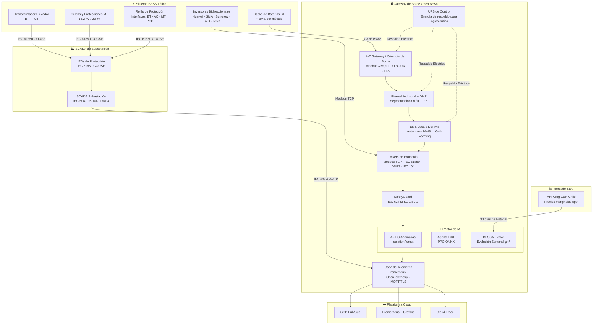
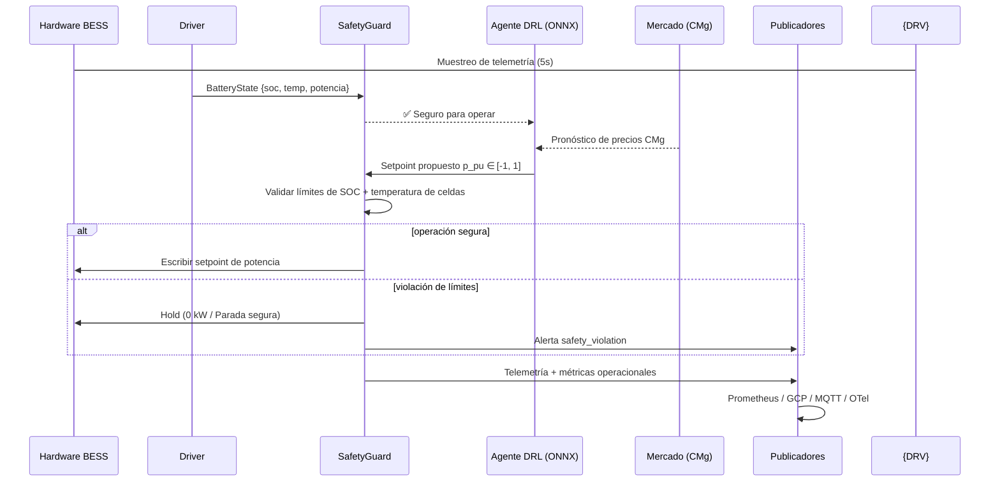
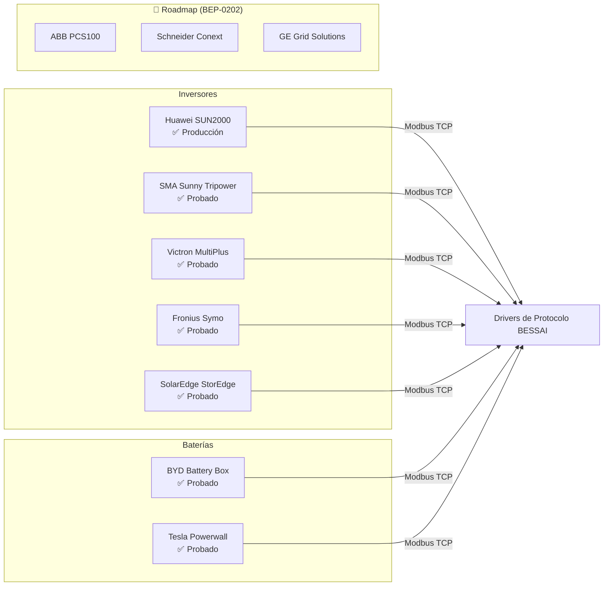

<div align="center">

# 🔋 BESSAI Edge Gateway

**Gateway de borde de grado industrial y código abierto para la gestión segura y optimizada por IA de Sistemas de Almacenamiento de Energía en Baterías (BESS).**

*Inteligencia de arbitraje autoevolutiva · Arquitectura y Roadmap IEC 62443 (SL-1/SL-2) · IEC 61850 · DNP3 · IEC 60870-5-104 · IEEE 1547-2018 IBR/GFM · NTSyCS Chile*

[](https://opensource.org/licenses/Apache-2.0)
[](https://www.python.org/)
[](https://github.com/bess-solutions/open-bess-edge/actions)
[](https://ghcr.io/bess-solutions/open-bess-edge)
[](docs/compliance/iec62443_mapping.md)
[](docs/compliance/ieee1547_mapping.md)
[-blue)](docs/compliance/ntscys_compliance.md)
[](tests/)
[](.)

[**Read in English 🇬🇧**](README.en.md) · [**Documentación**](https://bess-solutions.github.io/open-bess-edge) · [**Inicio Rápido**](#-inicio-rápido) · [**Servidor MCP**](docs/mcp_server.md) · [**Propuestas BEP**](docs/bep/BEP-0001.md) · [**Mapa de Ruta**](#-mapa-de-ruta)

</div>

---

## ¿Qué es BESSAI Edge Gateway?

BESSAI es una plataforma de cómputo en el borde (edge computing) lista para producción que se posiciona entre el hardware de tu Sistema de Almacenamiento de Energía en Baterías (BESS) y la infraestructura en la nube o el SCADA de despacho. Gestiona de manera autónoma:

- **Telemetría en tiempo real**: recolección directa desde inversores y BMS mediante protocolos industriales (Modbus TCP, IEC 61850, DNP3, IEC 60870-5-104).
- **Despacho optimizado por IA**: toma de decisiones en tiempo real usando un agente de Aprendizaje por Refuerzo Profundo (DRL) ejecutado localmente mediante ONNX (sin necesidad de conexión a internet para la toma de decisiones).
- **Autoevolución autónoma**: optimización de parámetros semanal mediante ciclos evolutivos a través de BESSAIEvolve.
- **Seguridad y resiliencia física**: aplicación de límites y guardas operacionales en el Gateway mediante la lógica `SafetyGuard` alineada con la arquitectura de ciberseguridad industrial IEC 62443 (Roadmap SL-1/SL-2).
- **Publicación multicanal segura**: envío de telemetría a GCP Pub/Sub, MQTT con TLS y OpenTelemetry.
- **Integración de arquitectura completa**: desde racks de baterías BT, inversores bidireccionales, transformadores elevadores, celdas de media tensión (MT), relés de protección, SCADA de planta, hasta el firewall industrial perimetral.

> **Entorno de Prueba y Simulación:** Hardware-in-the-Loop (HIL) y simulación Modbus TCP con perfiles de equipos industriales (Huawei, SMA, Sungrow, Victron, BYD, Tesla), evaluando arbitraje con datos de costos marginales ($CMg$) del SEN Chile.

---

## 🏗️ Arquitectura de Referencia


```mermaid
graph TB
    subgraph HW["⚡ Sistema BESS Físico"]
        BAT[Racks de Baterías BT<br/>+ BMS por módulo]
        INV[Inversores Bidireccionales<br/>Huawei · SMA · Sungrow · BYD · Tesla]
        TRF[Transformador Elevador<br/>BT → MT]
        MT[Celdas y Protecciones MT<br/>13.2 kV / 23 kV]
        PROT[Relés de Protección<br/>Interfaces: BT · AC · MT · PCC]
    end

    subgraph Edge["🖥️ Gateway de Borde Open BESS"]
        GW[IoT Gateway / Cómputo de Borde<br/>Modbus→MQTT · OPC-UA · TLS]
        FW[Firewall Industrial + DMZ<br/>Segmentación OT/IT · DPI]
        EMS[EMS Local / DERMS<br/>Autónomo 24-48h · Grid-Forming]
        UPS[UPS de Control<br/>Energía de respaldo para lógica crítica]
        DRV[Drivers de Protocolo<br/>Modbus TCP · IEC 61850 · DNP3 · IEC 104]
        SG[SafetyGuard<br/>IEC 62443 SL-1/SL-2]
        subgraph AI["🤖 Motor de IA"]
            IDS[AI-IDS Anomalías<br/>IsolationForest]
            DRL[Agente DRL<br/>PPO ONNX]
            EVO[BESSAIEvolve<br/>Evolución Semanal μ+λ]
        end
        TEL[Capa de Telemetría<br/>Prometheus · OpenTelemetry · MQTT/TLS]
    end

    subgraph SE["🏭 SCADA de Subestación"]
        SCADA_SE[SCADA Subestación<br/>IEC 60870-5-104 · DNP3]
        IED[IEDs de Protección<br/>IEC 61850 GOOSE]
    end

    subgraph Cloud["☁️ Plataforma Cloud"]
        GCP[GCP Pub/Sub]
        PROM[Prometheus + Grafana]
        OT[Cloud Trace]
    end

    subgraph Market["📈 Mercado SEN"]
        CMG[API CMg CEN Chile<br/>Precios marginales spot]
    end

    BAT -->|CAN/RS485| GW
    INV -->|Modbus TCP| DRV
    TRF & MT & PROT -->|IEC 61850 GOOSE| IED
    IED --> SCADA_SE
    GW --> FW
    FW --> EMS
    EMS --> DRV
    DRV --> SG
    SG --> AI
    CMG -->|30 días de historial| EVO
    AI --> TEL
    SCADA_SE -->|IEC 60870-5-104| TEL
    TEL --> GCP
    TEL --> PROM
    TEL --> OT
    UPS -.->|Respaldo Eléctrico| GW & FW & EMS
```

---

## 📊 Flujo de Datos


```mermaid
sequenceDiagram
    participant HW as Hardware BESS
    participant DRV as Driver
    participant SG as SafetyGuard
    participant DRL as Agente DRL (ONNX)
    participant MKT as Mercado (CMg)
    participant PUB as Publicadores

    HW->{DRV}: Muestreo de telemetría (5s)
    DRV->>SG: BatteryState {soc, temp, potencia}
    SG-->>DRL: ✅ Seguro para operar
    MKT-->>DRL: Pronóstico de precios CMg
    DRL->>SG: Setpoint propuesto p_pu ∈ [-1, 1]
    SG->>SG: Validar límites de SOC + temperatura de celdas
    alt operación segura
        SG->>HW: Escribir setpoint de potencia
    else violación de límites
        SG->>HW: Hold (0 kW / Parada segura)
        SG->>PUB: Alerta safety_violation
    end
    SG->>PUB: Telemetría + métricas operacionales
    PUB->>PUB: Prometheus / GCP / MQTT / OTel
```

---

## 🔌 Registro de Hardware Soportado


```mermaid
graph LR
    subgraph Inversores
        HW[Huawei SUN2000<br/>✅ Producción]
        SMA[SMA Sunny Tripower<br/>✅ Probado]
        VIC[Victron MultiPlus<br/>✅ Probado]
        FRO[Fronius Symo<br/>✅ Probado]
        SE[SolarEdge StorEdge<br/>✅ Probado]
    end
    subgraph Baterías
        BYD[BYD Battery Box<br/>✅ Probado]
        TES[Tesla Powerwall<br/>✅ Probado]
    end
    subgraph Pendientes["🔵 Roadmap (BEP-0202)"]
        ABB[ABB PCS100]
        SCH[Schneider Conext]
        GE[GE Grid Solutions]
    end
    DRIV[Drivers de Protocolo BESSAI]
    HW & SMA & VIC & FRO & SE & BYD & TES -->|Modbus TCP| DRIV
```

---

## 🔌 Servidor Model Context Protocol (MCP)

Open BESS Edge integra un **Servidor MCP** nativo en Python que expone las herramientas operacionales clave del sistema a asistentes basados en Inteligencia Artificial (como Claude Desktop o agentes autónomos). Esto te permite interactuar, auditar y operar el BESS en lenguaje natural con total transparencia tecnológica y sin datos simulados.

### Herramientas Expuestas
* **`get_battery_health`**: Consulta telemetría en tiempo real (SOC, voltajes, potencia activa/reactiva, temperaturas) vía Modbus TCP directo al hardware.
* **`diagnose_faults`**: Inspecciona alarmas activas y registros de error para diagnóstico rápido de celdas y controladores.
* **`predict_rul`**: Predice la Vida Útil Remanente (RUL) usando modelos cinéticos de estrés térmico de Arrhenius sobre el dataset histórico del sitio ([training_dataset.parquet](data/training_dataset.parquet)).
* **`cyber_hygiene_check`**: Ejecuta auditorías de robustez del sistema operativo del Gateway (hardening SSH, configuración TLS y políticas de firewall).

---

## ⚡ Inicio Rápido

### 0. Configuración Interactiva (Recomendado)

```bash
git clone https://github.com/bess-solutions/open-bess-edge.git
cd open-bess-edge
bash scripts/setup.sh   # Generador interactivo de config/.env para tu planta
```

### 1. Ejecución Local (Python)

```bash
make dev                  # Instala dependencias y configura hooks de calidad de código
bash scripts/setup.sh     # Genera archivo config/.env
make simulate             # Inicia BESSAI junto al simulador Modbus BESS local
make health               # Verifica el estado de salud de todos los componentes locales
```

### 2. Despliegue con Docker Compose (Recomendado en Producción)

```bash
git clone https://github.com/bess-solutions/open-bess-edge.git
cd open-bess-edge
bash scripts/setup.sh     # Genera configuración
docker compose -f infrastructure/docker/docker-compose.yml --profile simulator --profile monitoring up -d
```

* Grafana → http://localhost:3000 (Credenciales: revisar valor de `GF_SECURITY_ADMIN_PASSWORD` en `config/.env`)  
* Métricas → http://localhost:8000/metrics  
* Health Check → http://localhost:8000/health

---

## ✨ Características Principales

| Característica | Descripción | BEP / Especificación |
|---|---|---|
| **Drivers Multiprotocolo** | Modbus TCP nativo, IEC 61850, IEEE 2030.5 / SEP 2.0 | BEP-0100 |
| **Perfiles de Hardware** | Perfiles validados para Huawei, SMA, Victron, BYD y Tesla | – |
| **SafetyGuard** | Restricciones de SOC y térmicas para evitar daños físicos | Lógica embebida |
| **AI-IDS (Detección de Intrusos)**| Detección en tiempo real de anomalías en bus Modbus (IsolationForest) | Filtro de red |
| **Agente DRL de Arbitraje** | Inferencia offline de PPO + 8 modelos ONNX de nodos del SEN chileno | BEP-0200 |
| **BESSAIEvolve** | Optimización evolutiva automática de parámetros de despacho | BEP-0303 |
| **SCADA IEC 60870-5-104** | Telecontrol y enlace directo con despacho SCADA CEN | `IEC104Driver` |
| **Telecontrol DNP3** | Enlace estandarizado con protecciones de subestación | `DNP3Driver` |
| **Soporte IEEE 1547** | Control de frecuencia/voltaje reactivo y lógica Grid-Forming | `FrequencyResponseAgent` |

---

## 🛡️ Cumplimiento Regulatorio y Normativo (Chile)

| Norma / Estándar | Estado | Evidencia y Componente |
|---|---|---|
| **IEC 62443 SL-1** | ✅ Cumplido | [Mapeo de control perimetral](docs/compliance/iec62443_mapping.md) y MFA local (`totp_auth.py`) |
| **IEC 62443 SL-2** | ⚠️ Parcial | mTLS en drivers (`ot_tls_config.py`) y limitador de tasa de peticiones en API (`server.py`) |
| **NTSyCS Cap. 4.2** | ✅ GAP-001 | Control estricto de rampa de potencia ≤10%/min (`SafetyGuard`) |
| **NTSyCS Cap. 4.3** | ✅ GAP-002 | Respuesta rápida a frecuencia (droop PFR < 2s, `FrequencyResponseAgent`) |
| **NTSyCS Cap. 4.4** | ✅ GAP-011 | Control de voltaje reactivo Q/V droop (`ReactiveController`) |
| **NTSyCS Cap. 6.1** | ✅ GAP-003 | Enlace seguro mediante mTLS para datos hacia el CEN (`CENPublisher`) |
| **NTSyCS Cap. 6.2** | ✅ GAP-004 | Telecontrol SCADA por enlace directo IEC 60870-5-104 (`IEC104Driver`) |
| **Decreto 88 / PMGD** | ✅ GAP-007 | Lógica anti-arbitraje y límites PMGD (`PMGDComplianceEngine`) |
| **Ley 21.663 (Ciberseguridad)** | 📋 Roadmap | Integración automatizada de alertas de incidentes al CSIRT bajo diseño |
| **IEEE 2030.5 / SEP 2.0** | ✅ 10 Endpoints | Servidor integrado para interconexión inteligente ([BEP-0100](docs/bep/BEP-0100.md)) |

