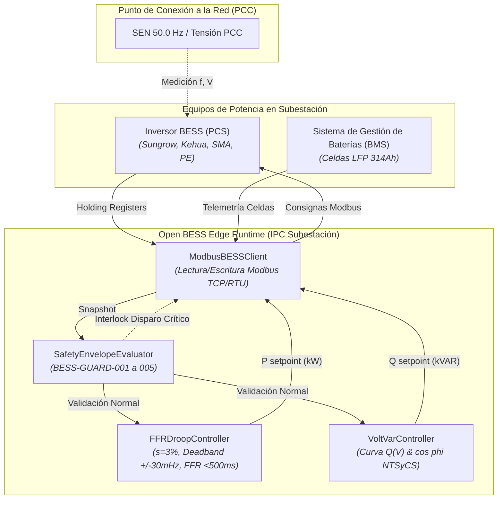

# ⚡ Open BESS Edge

[](https://opensource.org/licenses/Apache-2.0)
[](https://www.python.org/)
[-green)](https://www.cne.cl/)
[](https://www.coordinador.cl/)
[](https://github.com/bess-solutions/open-bess-edge)

**Open BESS Edge** es una plataforma de software abierta, determinística y de alta velocidad para controladores de borde (*Edge Gateways*) desplegados en sistemas de almacenamiento con baterías (BESS) conectados al **Sistema Eléctrico Nacional (SEN) de Chile**.

Diseñado para operar en Computadores Industriales (IPC) en subestaciones eléctricas con latencia de lazo cerrado sub-1ms, proporcionando **Respuesta Rápida de Frecuencia (FFR sub-500ms)**, **Control Primario de Frecuencia (PFC/Droop)**, **Regulación Dinámica de Tensión Volt/VAR ($Q(V)$)** y **Envolvente de Seguridad de Celdas de Hardware**.

---

## 🏗️ Arquitectura de Lazo Cerrado


```mermaid
flowchart TD
    subgraph Grid ["Punto de Conexión a la Red (PCC)"]
        SEN["SEN 50.0 Hz / Tensión PCC"]
    end

    subgraph Hardware ["Equipos de Potencia en Subestación"]
        PCS["Inversor BESS (PCS)<br><i>(Sungrow, Kehua, SMA, PE)</i>"]
        BMS["Sistema de Gestión de Baterías (BMS)<br><i>(Celdas LFP 314Ah)</i>"]
    end

    subgraph Edge ["Open BESS Edge Runtime (IPC Subestación)"]
        MB["ModbusBESSClient<br><i>(Lectura/Escritura Modbus TCP/RTU)</i>"]
        GUARD["SafetyEnvelopeEvaluator<br><i>(BESS-GUARD-001 a 005)</i>"]
        FFR["FFRDroopController<br><i>(s=3%, Deadband +/-30mHz, FFR <500ms)</i>"]
        VV["VoltVarController<br><i>(Curva Q(V) & cos phi NTSyCS)</i>"]
    end

    SEN -.->|"Medición f, V"| PCS
    PCS -->|"Holding Registers"| MB
    BMS -->|"Telemetría Celdas"| MB

    MB -->|"Snapshot"| GUARD
    GUARD -->|"Validación Normal"| FFR
    GUARD -->|"Validación Normal"| VV
    GUARD -.->|"Interlock Disparo Crítico"| MB

    FFR -->|"P setpoint (kW)"| MB
    VV -->|"Q setpoint (kVAR)"| MB
    MB -->|"Consignas Modbus"| PCS
```

---

## ⚡ Cumplimiento Normativo y Código de Red SEN

El controlador está calibrado y auditado con los parámetros oficiales del **Estudio de Control de Frecuencia y Determinación de Reservas (CFyDR) 2026 del Coordinador Eléctrico Nacional (CEN)** y la **Norma Técnica de Seguridad y Calidad de Servicio (NTSyCS)**:

| Exigencia Técnica | Estándar Normativo | Parámetro Calibrado en Open BESS Edge |
|---|---|---|
| **Frecuencia Nominal** | NTSyCS Art. 3-1 | $f_0 = 50.00\text{ Hz}$ |
| **Banda Muerta Primaria** | CEN CFyDR 2026 | $\Delta f = \pm 0.03\text{ Hz}$ ($\pm 30\text{ mHz}$) sin oscilación |
| **Estatismo Permanente ($s$)** | Res. CNE N° 343 | Configurable $s \in [0.02, 0.05]$ (Default: $s = 0.03$ / 3%) |
| **Umbral de Contingencia FFR** | CEN CFyDR 2026 | $|\Delta f| \ge 0.30\text{ Hz}$ ($f \le 49.70\text{ Hz}$ o $f \ge 50.30\text{ Hz}$) |
| **Tiempo de Respuesta FFR** | NTSyCS Cap. 3 | Inyección a plena potencia en $t < 500\text{ ms}$ |
| **Rampa de Operación Normal** | NTSyCS Art. 3-15 | Limitador automático $\le 20\% P_{nom}/\text{min}$ en cuasiestacionario |
| **Alivio Instantáneo en Carga** | Metodología CEN | Supresión inmediata a $0\text{ kW}$ de carga ante caída de frecuencia |
| **Regulación Dinámica Volt/VAR**| NTSyCS Art. 3-21 | Curva $Q(V)$ con banda muerta $\pm 2\% V_{nom}$ y respuesta en $t < 1\text{ s}$ |

---

## 🛡️ Envolvente de Seguridad de Hardware (Códigos BESS-GUARD)

El motor determinístico `SafetyEnvelopeEvaluator` actúa como segunda barrera de protección independiente del SCADA:

* **`BESS-GUARD-001` (Cell Undervoltage)**: Disparo y bloqueo si alguna celda cae por debajo de $2.50\text{ V}$.
* **`BESS-GUARD-002` (Cell Overvoltage)**: Disparo de protección si alguna celda supera $3.65\text{ V}$.
* **`BESS-GUARD-003` (Cell Overtemperature)**: Disparo de emergencia y parada si la temperatura excede $50.0\text{ °C}$ (NFPA 855).
* **`BESS-GUARD-004` (DC Isolation Fault)**: Interlock y apertura de interruptor DC si el aislamiento cae de $500\text{ k}\Omega$.
* **`BESS-GUARD-005` (Cell Imbalance Warning)**: Alarma si la dispersión de tensión $\Delta V = V_{max} - V_{min} > 50\text{ mV}$.

---

## 🔬 Módulo de Investigación y Estándares Abiertos (`research/`)

El repositorio incluye herramientas científicas de vanguardia para gemelos digitales electroquímicos:
* **BPX v1.1.1 (`bpx_parameter_store.py`)**: Estándar internacional (*The Faraday Institution*) para el intercambio seguro de parámetros de baterías.
* **Physics-Informed Digital Twin (`physics_informed_twin.py`)**: Estimación en tiempo real de resistencia interna $R_{int}$, riesgo de *Lithium Plating* y State of Health (SoH).
* **Battery Data Format (`bdf_telemetry_streamer.py`)**: Empaquetado de telemetría interoperable alineado con **Linux Foundation Energy (LF Energy)**.

---

## 🚀 Puesta en Marcha Rápida

### 1. Clonar e Instalar

```bash
git clone https://github.com/bess-solutions/open-bess-edge.git
cd open-bess-edge

# Crear y activar entorno virtual
python -m venv .venv
source .venv/bin/activate   # En Windows: .venv\Scripts\activate

# Instalar dependencias en modo editable
pip install -e .
```

### 2. Ejecutar la Suite de Pruebas Oficial del CEN

```bash
pytest tests/ -v
```

### 3. Ejecución del Nodo en Modo Simulación Determinística

```bash
python -m src.edge_node
```

Salida esperada de consola:
```text
[info] edge_node_starting             device_id=bess-node-linares-01 p_nominal_mw=1.0 site='S/E Linares 66/15 kV'
[info] modbus_simulation_active       host=127.0.0.1 port=502
--- Ciclo Normal (50.00 Hz) ---
P Setpoint: 0.0 kW | Latencia: 0.07 ms

--- Contingencia Severa SEN (49.65 Hz) ---
P Setpoint: 213.3 kW | Modo: FFR_EMERGENCY_FAST | Latencia: 0.04 ms
```

---

## 📄 Licencia

Este proyecto está liberado bajo la licencia de código abierto **Apache 2.0**. Consulte el archivo [LICENSE](LICENSE) para más detalles.
