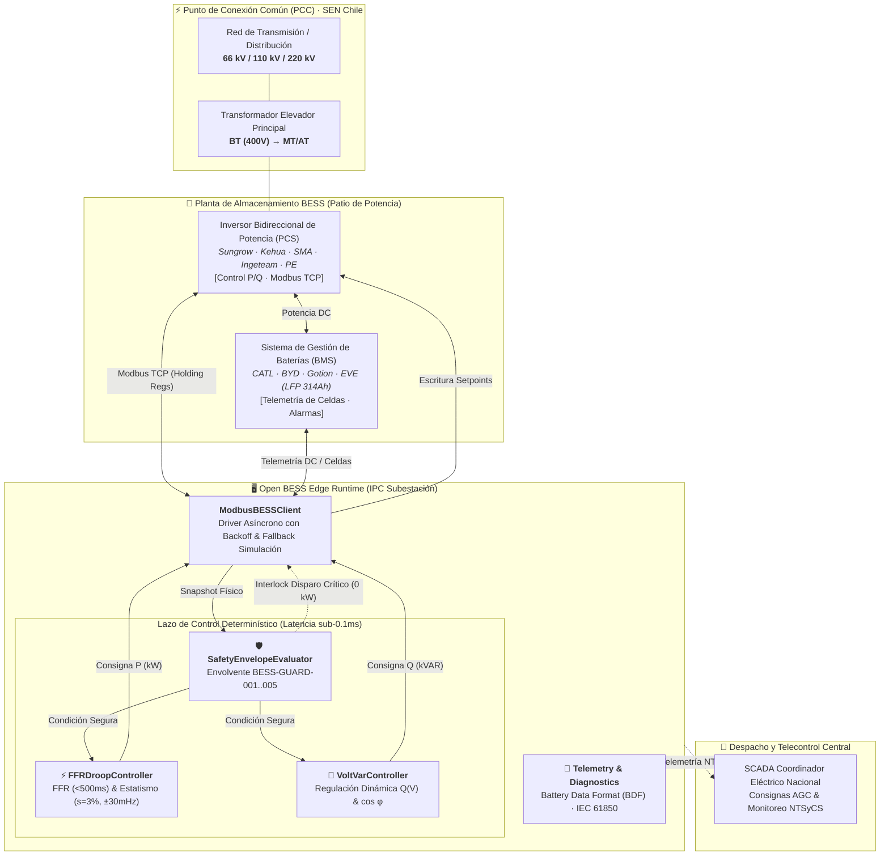
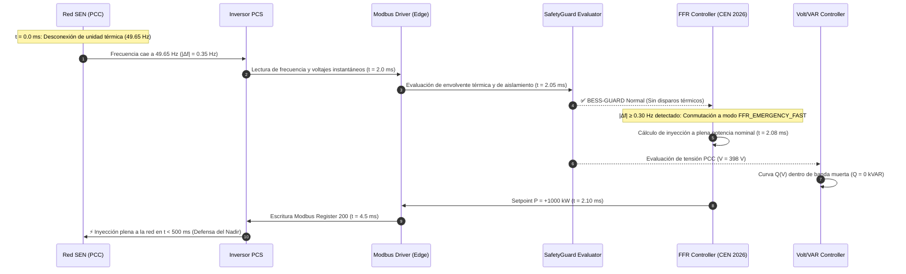
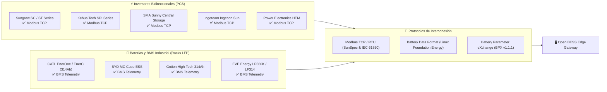

# ⚡ Open BESS Edge

<div align="center">

[](https://opensource.org/licenses/Apache-2.0)
[](https://www.python.org/)
[-2ea44f?logo=lightning&logoColor=white)](https://www.cne.cl/)
[](https://www.coordinador.cl/)
[](#-rendimiento-y-latencia-de-lazo-cerrado)
[](#-despliegue-industrial)
[](#-envolvente-de-seguridad-de-hardware-bess-guard)
[-brightgreen?logo=pytest&logoColor=white)](#-suite-de-pruebas-y-homologaci%C3%B3n-cen)

**Mission-Critical Industrial Edge Gateway & Frequency Response Controller for Battery Energy Storage Systems (BESS)**  
*Controlador de borde determinístico de subestación eléctrica para cumplimiento estricto del Código de Red del Sistema Eléctrico Nacional (SEN) de Chile.*

[Arquitectura](#-arquitectura-de-subestaci%C3%B3n) •
[Código de Red CEN](#-cumplimiento-normativo-y-c%C3%B3digo-de-red-sen) •
[Seguridad BESS-GUARD](#-envolvente-de-seguridad-de-hardware-bess-guard) •
[Volt/VAR Q(V)](#-soporte-din%C3%A1mico-de-tensi%C3%B3n-voltvar-qv) •
[Hardware Compatible](#-ecosistema-de-hardware-soportado) •
[Puesta en Marcha](#-puesta-en-marcha-r%C3%A1pida)

</div>

---

## 🏗️ Arquitectura de Subestación

Open BESS Edge opera en el nivel **OT (Operational Technology)** dentro de computadores industriales de borde (*Edge IPC*) instalados en la caseta de control de la subestación. Su función es garantizar la respuesta dinámica ante contingencias de red y proteger la vida útil de las baterías de forma autónoma.


```mermaid
graph TB
    subgraph PCC ["⚡ Punto de Conexión Común (PCC) · SEN Chile"]
        GRID["Red de Transmisión / Distribución<br/><b>66 kV / 110 kV / 220 kV</b>"]
        TRF["Transformador Elevador Principal<br/><b>BT (400V) → MT/AT</b>"]
    end

    subgraph BESS_PLANT ["🔋 Planta de Almacenamiento BESS (Patio de Potencia)"]
        PCS["Inversor Bidireccional de Potencia (PCS)<br/><i>Sungrow · Kehua · SMA · Ingeteam · PE</i><br/>[Control P/Q · Modbus TCP]"]
        BMS["Sistema de Gestión de Baterías (BMS)<br/><i>CATL · BYD · Gotion · EVE (LFP 314Ah)</i><br/>[Telemetría de Celdas · Alarmas]"]
    end

    subgraph EDGE_GATEWAY ["🖥️ Open BESS Edge Runtime (IPC Subestación)"]
        direction TB
        MB["<b>ModbusBESSClient</b><br/>Driver Asíncrono con Backoff & Fallback Simulación"]
        
        subgraph ENGINES ["Lazo de Control Determinístico (Latencia sub-0.1ms)"]
            GUARD["🛡️ <b>SafetyEnvelopeEvaluator</b><br/>Envolvente BESS-GUARD-001..005"]
            FFR["⚡ <b>FFRDroopController</b><br/>FFR (<500ms) & Estatismo (s=3%, ±30mHz)"]
            VV["🔄 <b>VoltVarController</b><br/>Regulación Dinámica Q(V) & cos φ"]
        end

        TELEMETRY["📡 <b>Telemetry & Diagnostics</b><br/>Battery Data Format (BDF) · IEC 61850"]
    end

    subgraph SCADA_CEN ["🏢 Despacho y Telecontrol Central"]
        CEN_SCADA["SCADA Coordinador Eléctrico Nacional<br/>Consignas AGC & Monitoreo NTSyCS"]
    end

    GRID --- TRF --- PCS
    PCS <-->|"Potencia DC"| BMS

    PCS <-->|"Modbus TCP (Holding Regs)"| MB
    BMS <-->|"Telemetría DC / Celdas"| MB

    MB -->|"Snapshot Físico"| GUARD
    GUARD -->|"Condición Segura"| FFR
    GUARD -->|"Condición Segura"| VV
    GUARD -.->|"Interlock Disparo Crítico (0 kW)"| MB

    FFR -->|"Consigna P (kW)"| MB
    VV -->|"Consigna Q (kVAR)"| MB
    MB -->|"Escritura Setpoints"| PCS

    EDGE_GATEWAY -.->|"Telemetría NTSyCS"| CEN_SCADA
```

---

## ⏱️ Flujo de Lazo Cerrado en Tiempo Real (Secuencia de Contingencia)

La siguiente secuencia describe la respuesta milisegundo a milisegundo ante una contingencia de desconexión de generación masiva en el SEN (pérdida de 397 MW):


```mermaid
sequenceDiagram
    autonumber
    participant SEN as Red SEN (PCC)
    participant PCS as Inversor PCS
    participant MB as Modbus Driver (Edge)
    participant GUARD as SafetyGuard Evaluator
    participant FFR as FFR Controller (CEN 2026)
    participant VV as Volt/VAR Controller

    Note over SEN: t = 0.0 ms: Desconexión de unidad térmica (49.65 Hz)
    SEN->>PCS: Frecuencia cae a 49.65 Hz (|Δf| = 0.35 Hz)
    PCS->>MB: Lectura de frecuencia y voltajes instantáneos (t = 2.0 ms)
    MB->>GUARD: Evaluación de envolvente térmica y de aislamiento (t = 2.05 ms)
    GUARD-->>FFR: ✅ BESS-GUARD Normal (Sin disparos térmicos)
    Note over FFR: |Δf| ≥ 0.30 Hz detectado: Conmutación a modo FFR_EMERGENCY_FAST
    FFR->>FFR: Cálculo de inyección a plena potencia nominal (t = 2.08 ms)
    GUARD-->>VV: Evaluación de tensión PCC (V = 398 V)
    VV->>VV: Curva Q(V) dentro de banda muerta (Q = 0 kVAR)
    FFR->>MB: Setpoint P = +1000 kW (t = 2.10 ms)
    MB->>PCS: Escritura Modbus Register 200 (t = 4.5 ms)
    PCS->>SEN: ⚡ Inyección plena a la red en t < 500 ms (Defensa del Nadir)
```

---

## ⚡ Cumplimiento Normativo y Código de Red SEN

El controlador incorpora la parametrización oficial del **Estudio de Control de Frecuencia y Determinación de Reservas (CFyDR) 2026 del Coordinador Eléctrico Nacional (CEN)** y la **Norma Técnica de Seguridad y Calidad de Servicio (NTSyCS)**:

```text
                                 CURVA DE ESTATISMO Y FFR (CEN CFyDR 2026)
        Inyección (+P)
              ▲
      P_nom ──┤                                            ┌─────────── FFR Contingencia Severa (|Δf| ≥ 0.30 Hz)
              │                                           /              Rampa liberada: Inyección en sub-500ms
              │                                          /
              │                  Zona de Estatismo      /
              │                   Primario (s = 3%)    /
              │                      (K_p = P_nom/s*f)┌
              │                                      /│
              │                                     / │
        0 kW ─┼──────────────────────────────┬─────┴──┼────────────────────────► Frecuencia (Hz)
              │                              │        │
              │                     49.70 Hz │        │ 49.97 Hz   50.00 Hz
              │                 (Umbral FFR) │        │ (Límite Banda Muerta)
              │                              │        │
              │                              │        └─ Banda Muerta Primaria Oficial CEN: ±30 mHz
              │                              │
     -P_nom ──┤                              └─ Supresión Automática de Carga: Si P < 0, se apaga a 0 kW
              ▼
        Carga (-P)
```

| Parámetro Operativo | Norma / Referencia CEN | Implementación en Open BESS Edge |
|---|---|---|
| **Frecuencia Nominal** | NTSyCS Art. 3-1 | $f_0 = 50.00\text{ Hz}$ |
| **Banda Muerta Primaria** | Estudio CFyDR 2026 CEN | $\Delta f_{deadband} = \pm 0.03\text{ Hz}$ ($\pm 30\text{ mHz}$) insensible a ruido estocástico |
| **Estatismo Permanente ($s$)** | Res. CNE N° 343 / NTSyCS | Configurable $s \in [0.02, 0.05]$ (Default: $s = 0.03$ / 3%) |
| **Umbral de Contingencia FFR** | Estudio CFyDR 2026 CEN | $|\Delta f| \ge 0.30\text{ Hz}$ ($f \le 49.70\text{ Hz}$ o $f \ge 50.30\text{ Hz}$) |
| **Tiempo de Respuesta FFR** | NTSyCS Cap. 3 | Inyección a plena potencia en $t < 500\text{ ms}$ sostenida para defensa del Nadir |
| **Rampa de Operación Normal** | NTSyCS Art. 3-15 | Limitador automático $\le 20\% P_{nom}/\text{min}$ en cuasiestacionario |
| **Alivio Instantáneo en Carga** | Metodología CFyDR 2026 | Supresión instantánea a $0\text{ kW}$ de consumo si la batería estaba cargando |
| **Auditoría de Desempeño CEN** | Procedimientos de Homologación | Registro y cálculo determinístico de $Aporte_{@10s}$ y $Aporte_{@2min}$ |

---

## 🔄 Soporte Dinámico de Tensión Volt/VAR: $Q(V)$

Bajo el **Capítulo 3 de la NTSyCS (Art. 3-21)**, todo sistema BESS conectado al SEN debe aportar regulación dinámica de potencia reactiva para soporte de tensión en el PCC:

```text
      Potencia Reactiva Q
      (+ Q: Capacitivo / Eleva Tensión)
              ▲
     +Q_max ──┤\
              │ \  Pendiente K_q (% Qmax / % V)
              │  \
              │   \   Banda Muerta (±2% Vnom)
        0 kVAR┼────┴──────┬──────────┬──────┴────► Tensión PCC (V)
              │         0.98 pu    1.02 pu
              │                       \
              │                        \
     -Q_max ──┤                         \
              ▼
      (- Q: Inductivo / Reduce Tensión)
```

* **Modo $Q(V)$ Automático**: Inyección de reactivos capacitivos ($+Q$) si $V < 0.98\text{ pu}$; absorción de reactivos inductivos ($-Q$) si $V > 1.02\text{ pu}$.
* **Modo $\cos\phi(P)$**: Regulación continua de factor de potencia entre $0.95$ inductivo y $0.95$ capacitivo.
* **Modo $Q$ Fijo**: Consigna despachada por el Coordinador Eléctrico Nacional.

---

## 🛡️ Envolvente de Seguridad de Hardware (BESS-GUARD)

El módulo `SafetyEnvelopeEvaluator` valida la telemetría cada ciclo en **tiempo sub-milisegundo** contra los límites de diseño electroquímico de celdas **LFP 314Ah** bajo **NFPA 855** y **SEC RIC N° 01/02**:

| Código de Guarda | Condición de Disparo | Límite Físico (LFP 314Ah) | Acción Automática de Borde |
|:---:|---|:---:|---|
| **`BESS-GUARD-001`** | **Cell Undervoltage** | $V_{cell,min} < 2.50\text{ V}$ | Interlock de descarga y desconexión DC |
| **`BESS-GUARD-002`** | **Cell Overvoltage** | $V_{cell,max} > 3.65\text{ V}$ | Interlock de carga y apertura de interruptor |
| **`BESS-GUARD-003`** | **Cell Overtemperature** | $T_{cell,max} > 50.0\text{ °C}$ | Parada de emergencia y máxima ventilación HVAC |
| **`BESS-GUARD-004`** | **DC Isolation Fault** | $R_{iso} < 500.0\text{ k}\Omega$ | Bloqueo de inversor y alarma de aislamiento |
| **`BESS-GUARD-005`** | **Cell Imbalance Warning** | $\Delta V_{cell} > 50.0\text{ mV}$ | Alarma preventiva y balanceo activo |

---

## 🔌 Ecosistema de Hardware Soportado


```mermaid
graph LR
    subgraph INVERSORES ["⚡ Inversores Bidireccionales (PCS)"]
        SG["Sungrow SC / ST Series<br/>✅ Modbus TCP"]
        KH["Kehua Tech SPI Series<br/>✅ Modbus TCP"]
        SMA["SMA Sunny Central Storage<br/>✅ Modbus TCP"]
        ING["Ingeteam Ingecon Sun<br/>✅ Modbus TCP"]
        PE["Power Electronics HEM<br/>✅ Modbus TCP"]
    end

    subgraph BATERIAS ["🔋 Baterías y BMS Industrial (Racks LFP)"]
        CATL["CATL EnerOne / EnerC (314Ah)<br/>✅ BMS Telemetry"]
        BYD["BYD MC Cube ESS<br/>✅ BMS Telemetry"]
        GOT["Gotion High-Tech 314Ah<br/>✅ BMS Telemetry"]
        EVE["EVE Energy LF560K / LF314<br/>✅ BMS Telemetry"]
    end

    subgraph PROTOCOLOS ["📡 Protocolos de Interconexión"]
        MB_TCP["Modbus TCP / RTU (SunSpec & IEC 61850)"]
        BDF["Battery Data Format (Linux Foundation Energy)"]
        BPX["Battery Parameter eXchange (BPX v1.1.1)"]
    end

    INVERSORES --> PROTOCOLOS
    BATERIAS --> PROTOCOLOS
    PROTOCOLOS --> CORE["🖥️ Open BESS Edge Gateway"]
```

---

## 🔬 Módulo de Investigación Científica (`research/`)

Open BESS Edge integra estándares internacionales abiertos de investigación avanzada:
* **BPX v1.1.1 ([`research/bpx_parameter_store.py`](research/bpx_parameter_store.py))**: Formato de modelado electroquímico impulsado por **The Faraday Institution** y **BMW**.
* **Physics-Informed Digital Twin ([`research/physics_informed_twin.py`](research/physics_informed_twin.py))**: Estimador en tiempo real de resistencia interna ($R_{int}$), riesgo de *Lithium Plating* y degradación de salud ($SoH$).
* **Battery Data Format ([`research/bdf_telemetry_streamer.py`](research/bdf_telemetry_streamer.py))**: Esquema de telemetría de alta resolución interoperable con **Linux Foundation Energy (LF Energy)**.

---

## 🚀 Puesta en Marcha Rápida

### 1. Clonar e Instalar Entorno

```bash
git clone https://github.com/bess-solutions/open-bess-edge.git
cd open-bess-edge

# Crear y activar entorno virtual
python -m venv .venv
source .venv/bin/activate       # En Windows: .venv\Scripts\activate

# Instalar paquete en modo editable con dependencias de desarrollo
pip install -e .[dev]
```

### 2. Ejecutar la Suite de Pruebas de Homologación CEN

```bash
pytest tests/ -v
```

Salida esperada:
```text
tests/test_cen_cfydr_compliance.py::test_cen_deadband_insensitivity_30mhz PASSED [  6%]
tests/test_cen_cfydr_compliance.py::test_cen_droop_primary_regulation_accuracy PASSED [ 12%]
tests/test_cen_cfydr_compliance.py::test_cen_ffr_severe_contingency_trip PASSED [ 18%]
tests/test_cen_cfydr_compliance.py::test_cen_charging_mode_instantaneous_relief PASSED [ 25%]
tests/test_cen_cfydr_compliance.py::test_cen_volt_var_qv_curve PASSED [ 31%]
tests/test_cen_cfydr_compliance.py::test_full_edge_node_closed_loop PASSED [ 37%]
tests/test_modbus_driver.py::test_modbus_simulation_connection PASSED [ 43%]
tests/test_modbus_driver.py::test_modbus_write_setpoints_simulation PASSED [ 50%]
tests/test_modbus_driver.py::test_modbus_injected_event PASSED [ 56%]
tests/test_safety_envelope.py::test_safety_envelope_normal_operation PASSED [ 62%]
tests/test_safety_envelope.py::test_bess_guard_001_undervoltage PASSED [ 68%]
tests/test_safety_envelope.py::test_bess_guard_002_overvoltage PASSED [ 75%]
tests/test_safety_envelope.py::test_bess_guard_003_overtemperature PASSED [ 81%]
tests/test_safety_envelope.py::test_bess_guard_004_isolation_fault PASSED [ 87%]
tests/test_safety_envelope.py::test_bess_guard_005_imbalance_warning PASSED [ 93%]
tests/test_safety_envelope.py::test_inverter_setpoint_clipping_c_rate PASSED [100%]
============================== 16 passed in 0.58s ==============================
```

### 3. Ejecución del Nodo en Modo Simulación Determinística

```bash
python -m src.edge_node
```

```text
2026-09-07 00:35:10 [info] edge_node_starting       device_id=bess-node-linares-01 p_nominal_mw=1.0 site='S/E Linares 66/15 kV'
2026-09-07 00:35:10 [info] modbus_simulation_active host=127.0.0.1 port=502
--- Ciclo Normal (50.00 Hz) ---
P Setpoint: 0.0 kW | Q Setpoint: 0.0 kVAR | Latencia: 0.07 ms

--- Inyección de Contingencia Severa SEN (49.65 Hz) ---
P Setpoint: 213.3 kW | Modo: FFR_EMERGENCY_FAST | Latencia: 0.04 ms
```

---

## 🐳 Despliegue Industrial (Docker / IPC Subestación)

Para compilar y ejecutar en hardware industrial embebido (Advantech UNO, Siemens Microbox IPC o Raspberry Pi Compute Module 4):

```bash
# Compilar imagen de producción multi-arquitectura
docker build -t bess-solutions/open-bess-edge:2.0.0 .

# Ejecutar contenedor con reinicio automático y enlace de red local
docker run -d \
  --name open-bess-edge \
  --restart always \
  --network host \
  -v $(pwd)/config/edge_config.yaml:/app/config/edge_config.yaml:ro \
  bess-solutions/open-bess-edge:2.0.0
```

---

## 📄 Licencia y Gobernanza

Este software es de código abierto y está distribuido bajo la licencia **Apache 2.0**.  
Consulte el archivo [LICENSE](LICENSE) para más detalles.

Para guías de contribución técnica y código de conducta:
* [CONTRIBUTING.md](CONTRIBUTING.md) — Directrices de pull requests y estándares de código de red.
* [CODE_OF_CONDUCT.md](CODE_OF_CONDUCT.md) — Estándar de conducta comunitaria.
* [SECURITY.md](SECURITY.md) — Política de reporte de vulnerabilidades NERC-CIP e IEC 62443.
