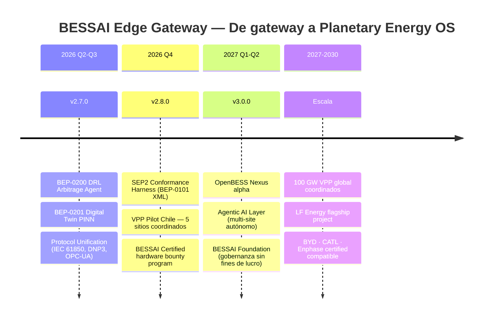

# BESSAI Edge Gateway — Roadmap Oficial v2.7–3.0

> **Versión:** 2026-02-24 · **Estado:** Activo  
> **Sustituye:** `docs/bessai_v2_roadmap.md` (archivado — era pre-v2.6)

---

## Estado actual — v2.6.0 (completado 2026-02-24)

| Área | Entregable | BEP |
|---|---|---|
| Comunicación DERMS | IEEE 2030.5 / SEP 2.0 Adapter (`sep2_adapter.py`) | BEP-0100 ✅ Active |
| Canal dual | MQTT Publisher integrado en `main.py` | — ✅ |
| Seguridad OT | TLS 1.2 min + mTLS para endpoints DERMS | BEP-0100 ✅ |
| Estrategia global | Global Standard Roadmap (`docs/GLOBAL_STANDARD_ROADMAP.md`) | — ✅ |
| Dev tooling | `pyrightconfig.json` · lint fixes · 26 nuevos tests | — ✅ |

**Suite de tests**: 458 passed · cobertura ≥ 80 % · CI: ruff ✅ mypy ✅ bandit ✅ trivy ✅

---

## Roadmap estratégico 2026–2030



---

## v2.7.0 — DRL Arbitrage Agent + Digital Twin (Q2-Q3 2026)

> **BEP-0200** (en elaboración) · Target: 2026-04-30

### BEP-0200: DRL Arbitrage Agent

El primer agente de aprendizaje por refuerzo profundo para optimización de despacho BESS en tiempo real.

**Arquitectura:**

```
src/agents/
  ├── bess_rl_env.py          ← Gymnasium env con precio spot como observación
  ├── drl_agent.py            ← Ray RLlib PPO/SAC wrapper + ONNX export
  └── arbitrage_policy.py     ← Política baseline rule-based para comparación

scripts/
  └── train_drl_agent.py      ← Entrenamiento con datos CMg reales (bessai-cen-data)

models/
  └── drl_arbitrage_v1.onnx   ← Modelo exportado para ONNX Runtime en edge
```

**Espacio de estado** (8 variables):

| Variable | Fuente | Escala |
|---|---|---|
| `soc_pct` | `read_tag("soc_pct")` | [0, 100] |
| `active_power_kw` | `read_tag("active_power_kw")` | [-max_w, max_w] |
| `cmg_actual_usd_mwh` | CEN API / bessai-cen-data | [0, 500] |
| `cmg_forecast_1h` | CMg Predictor v2 | [0, 500] |
| `cmg_forecast_4h` | CMg Predictor v2 | [0, 500] |
| `hora_del_dia` | tiempo UTC | [0, 23] |
| `dia_semana` | tiempo UTC | [0, 6] |
| `temp_bateria_c` | `read_tag("temp_c")` | [0, 60] |

**Función de recompensa:**

```python
reward = (
    power_kw * cmg_usd_mwh / 1000        # ingreso por despacho
    - degradacion_penalty(soc, cycles)    # penalización por degradación
    - safety_penalty(soc, temp)           # penalización por operar fuera de rango
)
```

**KPIs objetivo:**
- +25–35 % ingresos vs. política rule-based (validado en silico sobre datos CEN 2023-2025)
- Latencia de inferencia en edge: < 10 ms (ONNX Runtime sin GPU)
- Rollback automático a `onnx_dispatcher.py` si el agente falla

---

### BEP-0201: Digital Twin con PINN (Physics-Informed Neural Network)

Modelo híbrido física + IA que simula en tiempo real la degradación, temperatura y RUL (Remaining Useful Life).

**Objetivo:** Predecir RUL con error < 2 % — activar `SafetyGuard` proactivo antes de que ocurra el fallo.

**Stack:** `deepxde` (PINN library) + `scipy` (ODE solver) + ONNX export para edge

---

## v2.8.0 — Protocol Unification + VPP Pilot (Q4 2026)

> Target: 2026-10-31

### Protocolos a integrar

| Protocolo | Estándar | Mercado objetivo |
|---|---|---|
| **IEC 61850** | GOOSE/MMS | Subestaciones, Chile SEC |
| **DNP3** | IEEE 1815 | SCADA utilities USA/Australia |
| **OPC-UA** | IEC 62541 | Europa / industria 4.0 |
| **SunSpec Modbus** | SunSpec Alliance | Inversores solares globales |
| **IEEE 2030.5** | SEP 2.0 | California CPUC, AEMO ✅ (ya implementado v2.6) |

**`registry/`:** Un solo "Hardware Registry" con perfil por fabricante/modelo → generación automática de driver.

### VPP Pilot — Chile 5 sitios

```
[BESSAI-CL-001 Atacama] ─┐
[BESSAI-CL-002 Coquimbo] ─┤
[BESSAI-CL-003 Santiago] ─┤── VPP Aggregator (OpenADR 3.0) ── CEN/CDEC-SING
[BESSAI-CL-004 Valparaíso]─┤
[BESSAI-CL-005 Concepción]─┘
```

**Meta:** Coordinar respuesta de frecuencia AFR en < 500 ms, 5 MW agregados.

---

## v3.0.0 — OpenBESS Nexus (Q1-Q2 2027)

> "El sistema operativo de energía del planeta"

### Capas de la plataforma

| Capa | Componente | Estado |
|---|---|---|
| **Edge Swarm** | Miles de `open-bess-edge` Raspberry Pi 5 / industrial | Groundwork en v2.x |
| **Agentic AI Layer** | Agentes autónomos multi-sitio (LangGraph + DRL) | BEP-0200 → v3 |
| **VPP Orchestrator** | Federated Learning + OpenADR 3.0 global | VPP Pilot → v3 |
| **Marketplace P2P** | Smart contracts prosumidor-prosumidor (Hyperledger) | `p2p_trading.py` → expansión |
| **LCA & Carbon Engine** | Certificados tokenizados → EU CBAM compliance | `lca_engine.py` → expansión |
| **Multi-asset** | BESS + V2G + H₂ + bombas térmicas | Nuevo en v3 |

### Gobernanza: BESSAI Foundation

- **Modelo**: Linux Foundation / Apache Foundation style
- **Financiamiento**: GitHub Sponsors + CORFO + GIZ + Breakthrough Energy
- **Objetivo**: Neutralidad de proveedor — ningún fabricante controla el estándar

---

## Hitos de escala (2027–2030)

| Año | Meta | Indicador |
|---|---|---|
| 2027 | 100 MW coordinados en Chile | VPP Pilot expandido |
| 2028 | LF Energy flagship project | PR aprobado en `lfenergy-landscape` |
| 2029 | BYD / CATL / Enphase certified compatible | 3 fabricantes en `registry/` |
| 2030 | 100 GW VPP global | OpenBESS Nexus en producción |

---

## BEPs en progreso

| BEP | Título | Estado | Release |
|---|---|---|---|
| [BEP-0100](bep/BEP-0100.md) | IEEE 2030.5 / SEP 2.0 Adapter | ✅ **Active** | v2.6.0 |
| **BEP-0101** | SEP 2.0 XML/EXI Normativo (reemplaza JSON profile) | 📝 Draft | v2.8.0 |
| **BEP-0200** | DRL Arbitrage Agent (Ray RLlib PPO/SAC + ONNX) | 📝 En elaboración | v2.7.0 |
| **BEP-0201** | Digital Twin PINN — RUL < 2 % error | 💡 Propuesto | v2.7.0 |
| **BEP-0202** | Protocol Registry unificado (IEC 61850, DNP3, OPC-UA) | 💡 Propuesto | v2.8.0 |
| **BEP-0300** | VPP Orchestrator OpenADR 3.0 multi-sitio | 💡 Propuesto | v3.0.0 |

---

## Pendientes manuales (solo Rodrigo)

| Tarea | Prioridad | Desbloqueador |
|---|---|---|
| Activar GitHub Pages (MkDocs site) | 🔴 Alta | Settings → Pages → branch `gh-pages` |
| OpenSSF Gold badge | 🔴 Alta | `bestpractices.dev/projects/12001` — completar checkboxes |
| LF Energy Landscape | 🟡 Media | Fork `lfenergy/lfenergy-landscape` + PR con YAML + SVG logo |
| Iniciar IEC 62443 SL-2 formal | 🟡 Media | `docs/compliance/iec_62443_sl2_certification_path.md` + SSAF CORFO |
| Conectar Codecov | 🟢 Baja | `codecov.io/gh/bess-solutions/open-bess-edge` |

---

*Documento mantenido por la BESSAI Engineering Team. Actualizar en cada release junto con `CHANGELOG.md` y `PROJECT_STATUS.md`.*
