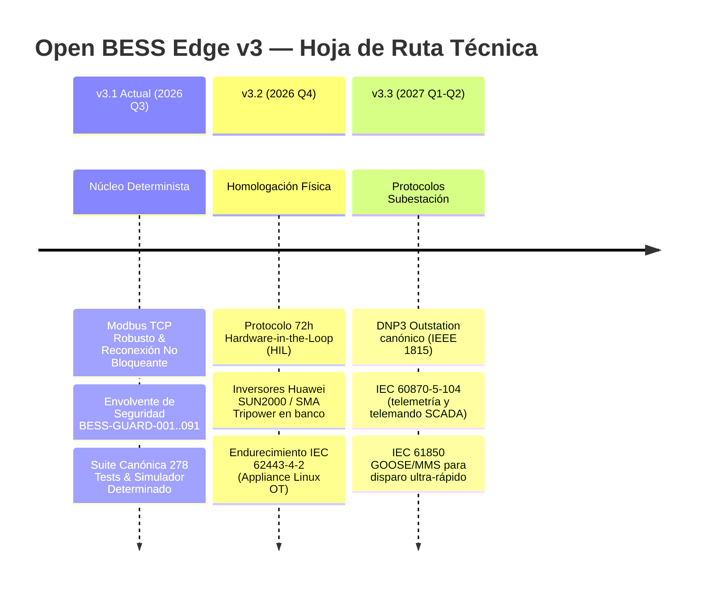

# Open BESS Edge — Roadmap Técnico v3.x

> **Estado:** Activo  
> **Ámbito:** Pasarela Determinista OT, Guardarraíl de Seguridad y Control FFR  
> **Última actualización:** 2026-09-25

---

## 1. Visión y Principios de Diseño v3

Open BESS Edge es una pasarela de computación en el borde (*edge gateway*) de código abierto, diseñada específicamente para entornos de **Tecnología de Operación (OT)** en subestaciones y plantas de almacenamiento de energía con baterías (BESS).

### Principios no negociables:
1. **Determinismo y Fail-Closed**: Toda falla de comunicación, lectura fuera de rango o divergencia de estado transiciona inmediatamente el sistema a estado seguro (`SAFE_STATE`, inyección cero).
2. **Cumplimiento Normativo Estricto**: Diseñado según las exigencias del Coordinador Eléctrico Nacional (CEN / NTSyCS) para Respuesta Rápida de Frecuencia (FFR <500 ms) y control de tensión Q(V).
3. **Separación de Responsabilidades**: El gateway ejecuta lógica de protección y despacho en tiempo real en subestación. La analítica avanzada, optimización de mercado y EMS pertenecen a la capa Northbound/Cloud, jamás dentro del lazo crítico de disparo.

---

## 2. Hitos y Fases de Desarrollo

```mermaid
timeline
    title Open BESS Edge v3 — Hoja de Ruta Técnica
    section v3.1 Actual (2026 Q3)
        Núcleo Determinista : Modbus TCP Robusto & Reconexión No Bloqueante
                            : Envolvente de Seguridad BESS-GUARD-001..091
                            : Suite Canónica 278 Tests & Simulador Determinado
    section v3.2 (2026 Q4)
        Homologación Física : Protocolo 72h Hardware-in-the-Loop (HIL)
                            : Inversores Huawei SUN2000 / SMA Tripower en banco
                            : Endurecimiento IEC 62443-4-2 (Appliance Linux OT)
    section v3.3 (2027 Q1-Q2)
        Protocolos Subestación : DNP3 Outstation canónico (IEEE 1815)
                               : IEC 60870-5-104 (telemetría y telemando SCADA)
                               : IEC 61850 GOOSE/MMS para disparo ultra-rápido
```

---

## 3. Detalle por Fase

### Fase 1: Núcleo Determinista y Protección OT (v3.1.0 — Actual)
- [x] **Driver Modbus TCP**: Implementación asíncrona sobre `pymodbus` con mapeo de perfiles vendor unificados (`registry/`).
- [x] **Envolvente BESS-GUARD**: 12 guardas de seguridad activas (tensión celular, temperatura de celda, resistencia de aislamiento, desbalance y timeout de comunicación).
- [x] **Control NTSyCS**: Algoritmo droop FFR con banda muerta configurable (±30 mHz) y respuesta garantizada bajo 500 ms.
- [x] **Control de Tensión Q(V)**: Limitador circular P-Q y curvas características de reactivos.
- [x] **Harness Determinista**: Simulador físico acoplado por loopback TCP para pruebas automatizadas repetibles con reloj manual.
- [x] **Truth-in-Advertising CI**: Script `scripts/verify_claims.py` validando correspondencia matemática y documental en cada commit.

---

### Fase 2: Homologación con Hardware Físico e IEC 62443 (v3.2 — 2026 Q4)
- [ ] **Protocolo de Homologación 72 Horas**:
  - Ensayo continuo ininterrumpido acoplado a banco HIL / inversor comercial real (Huawei SUN2000-100KTL / SMA Sunny Tripower).
  - Tasa de disparos espurios = 0 durante las 72 horas.
  - Validación de latencia paso a paso evento-a-setpoint <500 ms bajo saturación de red local.
- [ ] **Endurecimiento OT (IEC 62443-4-2)**:
  - Imagen mínima de appliance Linux (Alpine / Debian minimal) de solo lectura (*read-only rootfs*).
  - Integridad criptográfica de binarios y firmas de arranque.
  - Soporte para módulos TPM 2.0 y almacenamiento seguro de certificados mTLS.
- [ ] **Watchdog Físico**:
  - Integración con perro guardián por hardware (Linux `/dev/watchdog`) para auto-recuperación de nodo sin intervención humana.

---

### Fase 3: Integración de Subestación y Telemetría Northbound (v3.3 — 2027 Q1-Q2)
- [ ] **DNP3 Outstation (IEEE 1815)**:
  - Exposición de telemetría de planta y puntos de control para centros de despacho y SCADA de transmisión.
- [ ] **IEC 60870-5-104**:
  - Conexión redundante a telecontrol de operadores de red (TSO/DSO).
- [ ] **IEC 61850 GOOSE**:
  - Soporte de mensajes GOOSE sobre capa Ethernet para desconexión y disparo coordinado en subestación.
- [ ] **Telemetría Segura Northbound**:
  - Conector MQTT Sparkplug B / OpenTelemetry para streaming de diagnósticos hacia EMS/SCADA central sin comprometer el aislamiento OT.

---

## 4. No-Objetivos Explícitos (Non-Goals)

Para salvaguardar la confiabilidad y certificabilidad industrial de Open BESS Edge:
- **No se implementarán modelos de lenguaje locales (LLMs)** en el gateway de subestación.
- **No se ejecutarán bucles autónomos de auto-mutación o aprendizaje por refuerzo continuo** en el runtime de borde.
- **No se mezclarán proyecciones comerciales de mercado financiero o arbitraje especulativo** dentro de la pasarela física. Toda optimización económica reside en sistemas EMS/Cloud de nivel superior.
