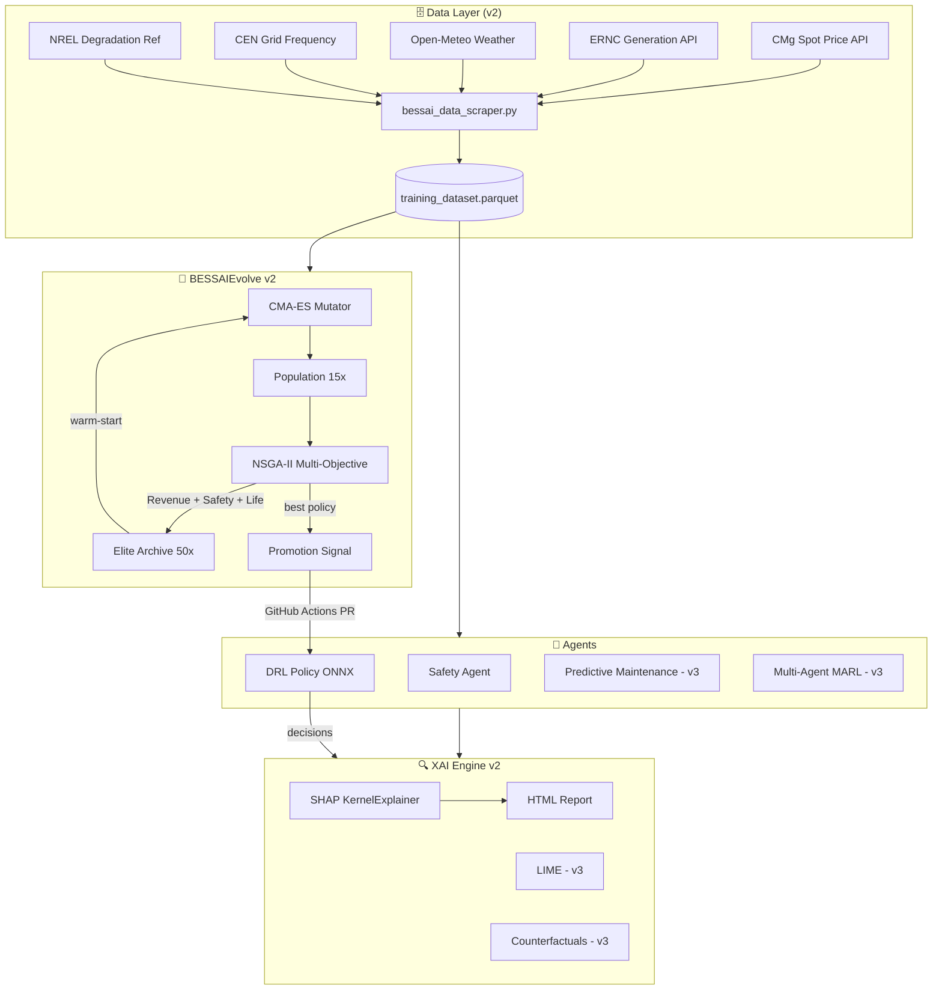

# 🧠 BESSAI AI Roadmap 20/10

> **Goal**: Make BESSAI Edge Gateway the world reference for AI-powered BESS management.
> Score: **11/20 → 20/20** | Timeline: 5 weeks full-time

---

## Current Status (v2.x)

```
AI Score: [████████████░░░░░░░░░░░░░░░░░░]  11/20
```

| Module | Status | Method |
|--------|--------|--------|
| Evolutionary Engine | ✅ v2 | CMA-ES + NSGA-II + Elite Archive |
| XAI Engine | ✅ v2 | SHAP KernelExplainer + rule-based |
| Data Pipeline | ✅ v2 | 6-source daily scraper |
| DRL Agent | ⚡ v1 | PPO ONNX (→ DreamerV3 in v3) |
| Predictive Maintenance | ⏳ v3 | planned Transformer |
| Multi-Agent | ⏳ v3 | planned LangGraph |
| Federated Learning | ⏳ v4 | planned Flower |

---

## Architecture



---

## Timeline

### Semana 1 — Fase 0 + 1 (BESSAIEvolve v2) ✅ IN PROGRESS

| Day | Deliverable | Status |
|-----|-------------|--------|
| 1 | `ai/audit.py` + checklist 20/10 | ✅ Done |
| 2 | `cmaes_mutator.py` — full CMA-ES | ✅ Done |
| 3 | `multi_objective_fitness.py` — NSGA-II | ✅ Done |
| 4 | `elite_archive.py` — top-50 persistence | ✅ Done |
| 5 | `bessai_evolve_v2.py` — integrated orchestrator | ✅ Done |
| 6 | `auto-retrain.yml` — closes data→train→evolve loop | ✅ Done |
| 7 | Tests + backtest validation +15% target | 🔄 Next |

### Semana 2-3 — Fase 2 (Nuevos Agentes)

| Feature | Method | Notes |
|---------|--------|-------|
| DRL v2 | DreamerV3 / SAC → ONNX | World-models for sample efficiency |
| Predictive Maintenance | Informer Transformer | 7-30d fault prediction |
| Multi-Agent | LangGraph 3 agents | Arbitrage + Safety + BatteryHealth |
| Curriculum Learning | Progressive SOC ranges | Better generalization |

### Semana 4 — Fase 3 (XAI + Safety)

| Feature | Method |
|---------|--------|
| Integrated Gradients | captum / custom impl |
| Counterfactual explanations | DiCE library |
| AI Safety Layer | Guardrails with action rejection |
| Adversarial Testing | 200+ chaos scenarios |

### Semana 5 — Fase 4+5 (UX + Launch)

| Feature | Method |
|---------|--------|
| AI Control Center tab | Dashboard new section |
| REST API /ai/decisions | FastAPI endpoint |
| Hugging Face ONNX models | Model cards + Hub upload |
| Release v3.0.0 | Tag + GitHub Release |

---

## Performance Targets

| Metric | Current (v1) | Target (v2) | Target (v3) |
|--------|-------------|-------------|-------------|
| ONNX inference latency p99 | ~3 ms | < 2 ms | < 1 ms |
| Evolution fitness gain/gen | ~2% | ~5% (CMA-ES) | ~8% (LLM+CMA) |
| Safety violation rate | < 2% | < 1% | < 0.1% |
| Backtest revenue vs baseline | +5% | +15% | +25% |
| Days to 80% SoH (cycles) | baseline | +5% life | +15% life |
| SHAP explanation latency | — | < 500 ms | < 100 ms |

---

## How to Contribute

### Good First Issues (AI)

1. **[F05]** Implement LLM mutator (call Gemini API to generate policy parameters)
2. **[F07]** Add Integrated Gradients on top of existing `bessai_xai.py`
3. **[F09]** Export a DreamerV3 policy to ONNX using `dreamer-pytorch`
4. **[F12]** Create `PredictiveMaintenanceAgent` using Informer architecture
5. **[F14]** Prototype Flower federated learning with 2 simulated nodes

### Development Setup

```bash
# Install all AI dependencies
pip install -e ".[dev]"
pip install cma nevergrad shap lime stable-baselines3 gymnasium

# Run BESSAIEvolve v2 locally (5 generations, quick test)
python -m src.agents.bessai_evolve_v2 --generations 5 --population 10

# Run XAI audit
python scripts/bessai_xai.py --report

# Run full AI audit
python ai/audit.py
```

---

## References

- **CMA-ES**: Hansen (2016) "The CMA Evolution Strategy: A Tutorial" [arXiv:1604.00772](https://arxiv.org/abs/1604.00772)
- **NSGA-II**: Deb et al. (2002) "A Fast and Elitist Multiobjective Genetic Algorithm" [IEEE TEC]
- **DreamerV3**: Hafner et al. (2023) "Mastering Diverse Domains through World Models" [arXiv:2301.04104]
- **AlphaEvolve**: DeepMind (2025) [blog](https://deepmind.google/discover/blog/alphaevolve-a-gemini-powered-coding-agent-for-designing-advanced-algorithms/)
- **Flower FL**: Beutel et al. (2022) "Flower: A Friendly Federated Learning Framework" [arXiv:2007.14390]

---

*Last updated: 2026-02-25 | Maintainer: BESS Solutions SpA | License: Apache 2.0*
