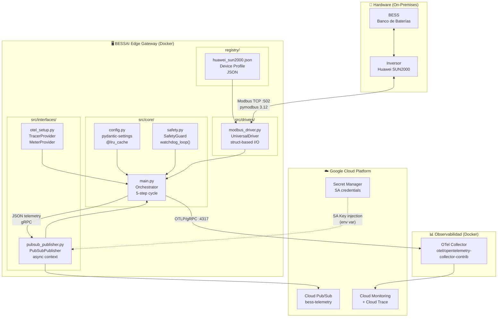

# BESSAI Edge Gateway — Architecture Decision Records

> Este documento registra las decisiones de arquitectura (ADRs) del sistema.  
> Cada ADR explica **qué** se decidió, **por qué**, y qué alternativas se descartaron.

---

## Diagrama de Arquitectura — v0.3.0



---

## Flujo de Datos por Ciclo

```
T + 0s   UniversalDriver.read_tag("active_power")  → Modbus TCP READ_HOLDING_REGISTERS
T + 0s   UniversalDriver.read_tag("soc")            → Modbus TCP READ_HOLDING_REGISTERS
T + ε    SafetyGuard.check_safety(telemetry)        → bool (block/pass)
T + ε    watchdog_loop (background task)            → WRITE watchdog_heartbeat register
T + δ    PubSubPublisher.publish(payload)            → GCP Pub/Sub (async HTTP/2)
T + δ    OpenTelemetry spans auto-instrumented      → OTel Collector :4317
T + 5s   asyncio.sleep(WATCHDOG_TIMEOUT)            → repite ciclo
```

---

## ADR-001: Uso de `struct` en lugar de `BinaryPayloadDecoder`

**Fecha:** 2026-02-19  
**Estado:** ✅ Aceptado

### Contexto
`pymodbus` < 3.7 incluía `BinaryPayloadDecoder/Builder` y `Endian` para manejar el encoding de registros Modbus en distintos tipos de datos. Estas clases fueron **eliminadas** en pymodbus 3.12.

### Decisión
Reescribir `_decode_value()` y `_encode_value()` en `modbus_driver.py` usando el módulo `struct` de la stdlib Python.

```python
# Antes (pymodbus < 3.7)
decoder = BinaryPayloadDecoder.fromRegisters(registers, byteorder=Endian.Big)
value = decoder.decode_32bit_int()

# Después (pymodbus 3.12 + struct)
raw_bytes = b"".join(r.to_bytes(2, "big") for r in registers)
(value,) = struct.unpack(">i", raw_bytes)  # > = big-endian, i = signed int32
```

### Alternativas descartadas
- **Mantener pymodbus < 3.7:** Habría bloqueado compatibilidad con Python 3.14.
- **Usar `pymodbus.payload` de otra librería fork:** Añade dependencia sin mantenimiento.

### Consecuencias
- ✅ Sin dependencias externas para encoding — solo stdlib.
- ✅ Compatible con Python 3.10–3.14+.
- ⚠️ Requiere conocimiento de `struct` format strings para mantener.

---

## ADR-002: `_LazySettings` proxy para carga diferida de config

**Fecha:** 2026-02-19  
**Estado:** ✅ Aceptado

### Contexto
`pydantic-settings` intenta leer el archivo `.env` en el momento en que `Settings()` es instanciado. Si el módulo `config.py` instanciaba `settings = get_settings()` a nivel de módulo, cualquier import de `settings` en tests fallaba si `.env` no existía.

### Decisión
Implementar `_LazySettings` proxy que delega `__getattr__` a `get_settings()`:

```python
class _LazySettings:
    def __getattr__(self, name: str):
        return getattr(get_settings(), name)

settings = _LazySettings()  # No llama a get_settings() al importar
```

Los tests usan `conftest.py` para inyectar variables mínimas via `os.environ`.

### Consecuencias
- ✅ `from src.core.config import settings` sigue funcionando en todo el código.
- ✅ Tests no necesitan un archivo `.env`.
- ⚠️ Type checkers no pueden inferir el tipo de `settings` — necesita `cast()` en código estrictamente tipado.

---

## ADR-003: Workload Identity Federation en lugar de SA JSON keys en CI

**Fecha:** 2026-02-19  
**Estado:** ✅ Aceptado

### Contexto
El workflow de GitHub Actions necesita autenticarse contra GCP para publicar imágenes Docker en Artifact Registry.

### Decisión
Usar **Workload Identity Federation (WIF)** con OIDC de GitHub Actions (provisioned via Terraform) en lugar de exportar y guardar una SA key como GitHub Secret.

### Alternativas descartadas
- **SA key en GitHub Secrets:** Requiere rotación manual, riesgo de filtración si se hace `git log` del secret.
- **Service Account impersonation sin WIF:** Aún requiere un key inicial.

### Consecuencias
- ✅ Zero static credentials en GitHub.
- ✅ El token OIDC de GitHub expira en minutos — surface de ataque mínima.
- ⚠️ Requiere configurar Terraform con el pool de identidad antes de que el workflow funcione.

---

## ADR-004: Pub/Sub con DLQ (Dead Letter Queue)

**Fecha:** 2026-02-19  
**Estado:** ✅ Aceptado

### Contexto
Si el consumidor de Pub/Sub falla repetidamente al procesar un mensaje (e.g. formato inválido), el mensaje puede "envenenar" la cola y bloquear el procesamiento posterior.

### Decisión
Crear un topic DLQ (`bess-telemetry-{env}-dlq`) y configurar la subscription principal con `max_delivery_attempts = 5`. Tras 5 fallos, el mensaje se mueve al DLQ para análisis sin bloquear el flujo principal.

### Consecuencias
- ✅ Flujo principal nunca bloqueado por mensajes malformados.
- ✅ DLQ permite análisis forense de mensajes problemáticos.
- ⚠️ El DLQ debe monitorearse — un DLQ con mensajes indica un bug en el publisher o consumer.

---

## ADR-005: Docker Compose profiles para modo simulador

**Fecha:** 2026-02-19  
**Estado:** ✅ Aceptado

### Contexto
Desarrolladores sin acceso a hardware real necesitan poder ejecutar el stack completo localmente.

### Decisión
Usar Docker Compose [profiles](https://docs.docker.com/compose/profiles/):
- **Default:** `gateway` + `otel-collector` (requiere hardware real)
- **`--profile simulator`:** añade `modbus-simulator` y `gateway-sim` (apunta al simulador)

### Consecuencias
- ✅ Un solo `docker-compose.yml` para prod y dev.
- ✅ El simulador no consume recursos en producción.
- ⚠️ El simulador (`oitc/modbus-server`) simula registros estáticos — no simula degradación dinámica.

---

## Matriz de Dependencias

```
src/core/config.py
  └── pydantic-settings
  └── pydantic

src/core/safety.py
  └── src/core/config.py
  └── src/drivers/modbus_driver.py

src/core/main.py
  └── src/core/config.py
  └── src/core/safety.py
  └── src/drivers/modbus_driver.py
  └── src/interfaces/pubsub_publisher.py
  └── src/interfaces/otel_setup.py

src/drivers/modbus_driver.py
  └── pymodbus (AsyncModbusTcpClient)
  └── struct (stdlib)
  └── registry/*.json (device profiles)

src/interfaces/pubsub_publisher.py
  └── gcloud-aio-pubsub
  └── src/core/config.py

src/interfaces/otel_setup.py
  └── opentelemetry-sdk
  └── opentelemetry-exporter-otlp-proto-grpc
  └── src/core/config.py
```
