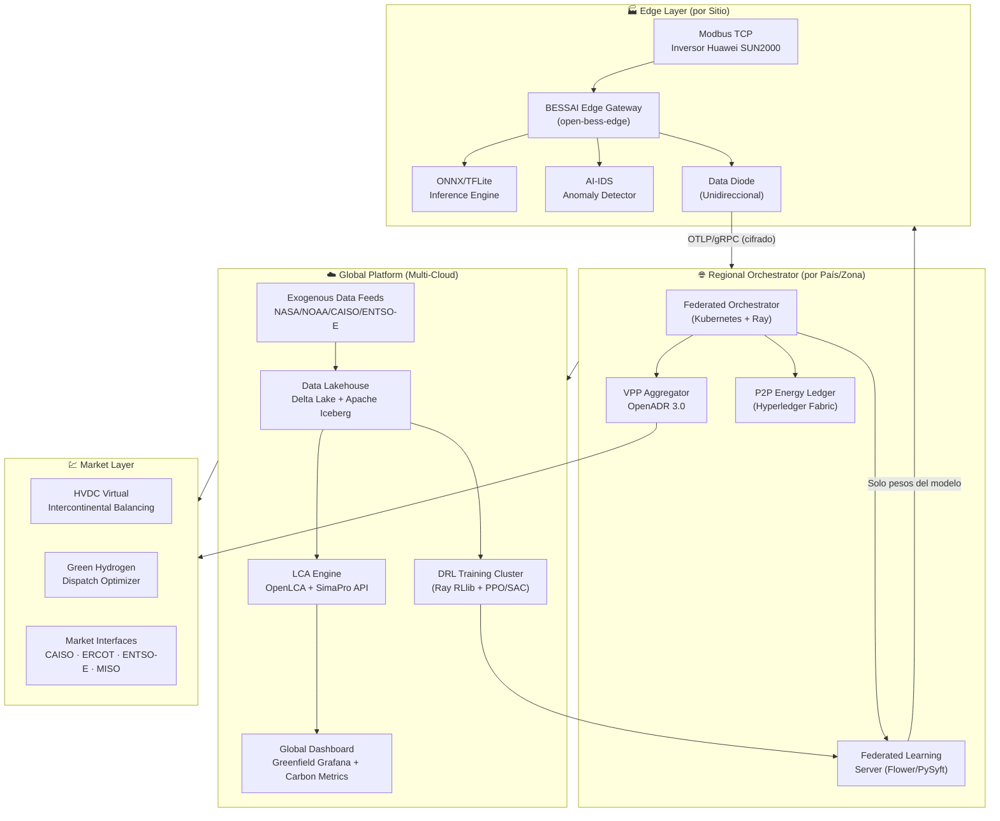
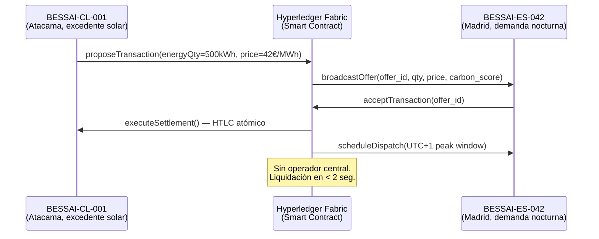
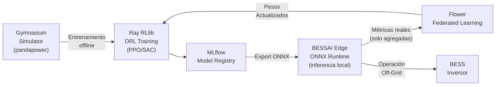
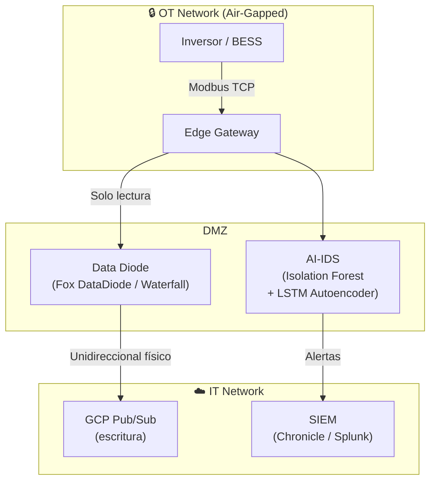
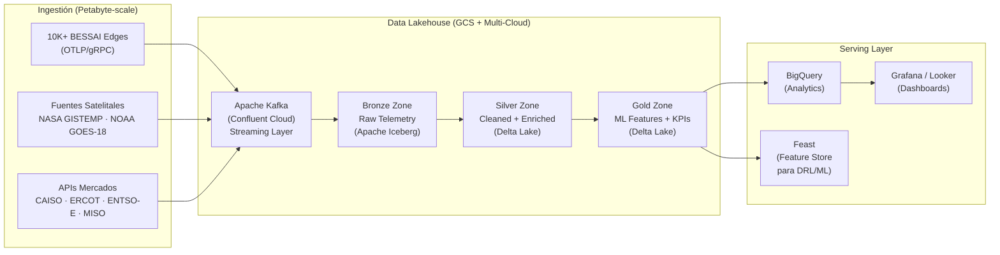
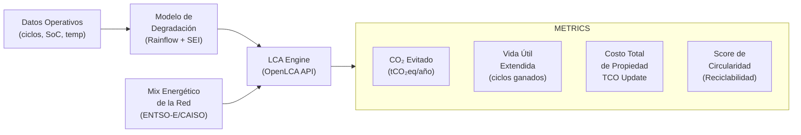

# BESSAI v2.0 — Technical Roadmap
### *Chief Global Architect & AI Research Lead — 2026-02-19*

> [!IMPORTANT]
> Este documento representa la evolución estratégica de BESSAI desde un sistema _single-site_ hacia una **plataforma de energía distribuida de escala planetaria**. Cada área está detallada con stack tecnológico, justificación de decisiones y un plan de implementación por fases.

---

## Resumen Ejecutivo

| Dimensión | v1.0 (hoy) | v2.0 (target) |
|---|---|---|
| **Escala** | 1 sitio, 1 inversor | Miles de sitios, VPP global |
| **IA** | MILP determinístico | DRL + Federated Learning |
| **Seguridad** | Watchdog reactivo | AI-IDS + Data Diodes |
| **Datos** | BigQuery + Pub/Sub | Data Lakehouse (Petabyte-scale) |
| **Impacto** | Eficiencia local | LCA + Huella de carbono evitada |
| **Conectividad** | Cloud-only | Edge-first, off-grid capable |

---

## Arquitectura Global v2.0



---

## Área 1 — Federated Orchestration (VPP & Multi-Site)

### El problema que resuelve
Un BESSAI Edge aislado es un **tomador de precios**. Una VPP con 10.000 BESSAI agrupados es un **hacedor de mercado** que puede participar en mercados de capacidad, frecuencia y energía.

### Stack Tecnológico

| Componente | Tecnología | Justificación |
|---|---|---|
| Orquestación de flota | **Kubernetes Federation (KubeFed)** | Un control plane que gobierna clusters en múltiples nubes y geografías |
| VPP Aggregation | **OpenADR 3.0** | Estándar de respuesta a la demanda certificado por FERC/ENTSO-E |
| P2P Energy Trading | **Hyperledger Fabric** | Ledger privado/permisionado; throughput > 3.000 tx/seg; no requiere tokens volátiles |
| Intercontinental Dispatch | **HVDC Virtual Scheduling API** + **Green Hydrogen Dispatch** | Desacopla generación solar (Atacama, Sahara) de demanda nocturna europea |
| Comunicación Federada | **gRPC + mTLS** | Latencia < 10ms para señales de control regional |

### Arquitectura P2P Energy Trading



### KPIs de Escala

- **Latencia de señal VPP → Edge:** < 500ms (P99)
- **Nodos soportados por cluster regional:** 10.000+
- **Throughput P2P Ledger:** > 3.000 tx/seg

---

## Área 2 — Edge AI & Deep Reinforcement Learning

### El problema que resuelve
MILP es óptimo en condiciones predecibles. Los mercados eléctricos son **no estacionarios** — el DRL aprende comportamientos que MILP nunca podría modelar (anticipación de cascada de precios, gaming de mercado con múltiples jugadores).

### Stack Tecnológico

| Componente | Tecnología | Justificación |
|---|---|---|
| Inferencia en Edge | **ONNX Runtime** + **TensorFlow Lite** | < 50MB, corre en ARM64/x86, sin GPU |
| Entrenamiento DRL | **Ray RLlib** con **PPO** y **SAC** | PPO: estable en prod; SAC: óptimo para espacio de acción continuo (potencia, SoC target) |
| Federated Learning | **Flower (flwr)** o **PySyft** | Solo gradientes/pesos salen del edge — datos jamás salen del sitio |
| Pruebas de simulación | **Gymnasium + pandapower** | Entorno de red eléctrica para pre-entrenar antes de desplegar |
| Model Registry | **MLflow** en GCP Artifact Registry | Versionado, A/B testing entre MILP y DRL, rollback automático |

### Ciclo de Vida del Modelo DRL



### Modos de Operación del Edge AI

| Modo | Condición | Modelo Activo |
|---|---|---|
| **Cloud-Connected** | Internet disponible | DRL actualizado en tiempo real |
| **Off-Grid / Isla** | Sin internet | ONNX local (último modelo descargado) |
| **Degradado** | Fallo de sensor | Fallback a reglas de safety determinísticas |
| **Black Start** | Catástrofe total | Protocolo autónomo de reactivación secuencial |

---

## Área 3 — Resiliencia Cibernética y Física (Defense-in-Depth)

### Stack de Seguridad



### AI-IDS — Detection Engine

El detector de intrusiones analiza tráfico Modbus usando dos capas:

1. **Isolation Forest** (sklearn) — detección de outliers en distribución de registros leídos. Un ataque de _reconnaissance_ genera patrones de lectura anómalos.
2. **LSTM Autoencoder** (TFLite, edge-deployed) — modela la secuencia temporal normal de lecturas. Error de reconstrucción > umbral → alerta.

```python
# Pseudo-código del pipeline AI-IDS
class ModbusAnomalyDetector:
    def score(self, modbus_frame: ModbusFrame) -> float:
        features = self._extract(modbus_frame)          # FC, address, count, timing
        iso_score = self.isolation_forest.score(features)
        lstm_error = self.autoencoder.reconstruction_error(features)
        return 0.4 * iso_score + 0.6 * lstm_error       # ensemble

    def alert_if_anomalous(self, score: float) -> None:
        if score > THRESHOLD:
            self.publish_to_siem(severity="CRITICAL")
            self.trigger_network_isolation()             # corte físico del puerto
```

### Protocolo Black Start Autónomo

| Fase | Acción | Tiempo máximo |
|---|---|---|
| **T+0** | Detección de fallo de red / desconexión total | 0s |
| **T+30s** | Edge verifica SoC > 20% → activa modo isla | 30s |
| **T+2min** | Cargas críticas priorizadas por tabla local | 2min |
| **T+10min** | ONNX local asume control de despacho completo | 10min |
| **T+reconexión** | Sincronización de fase con red → re-conexión suave | Variable |

---

## Área 4 — Global Data Lakehouse

### Arquitectura de Datos a Escala Planetaria



### Fuentes Exógenas Integradas

| Fuente | Datos | Frecuencia | Uso |
|---|---|---|---|
| **NASA GISTEMP / POWER** | Irradiancia, temperatura superficial | Horario | Forecast de generación solar |
| **NOAA GOES-18** | Imágenes satelitales de nubes | 15 min | Predicción de sombras en tiempo real |
| **CAISO OASIS** | Precios spot California | 5 min | Señal de despacho para BESS oeste-USA |
| **ERCOT API** | Precios tiempo real Texas | 15 min | Arbitraje de energía |
| **ENTSO-E Transparency** | Precios pan-europeos + mix de generación | 1 hora | Despacho intercontinental |
| **CoinMetrics** | Costos de transacción en Ledger P2P | Continuo | Optimización de fees P2P |

---

## Área 5 — Life Cycle Assessment (LCA) en Tiempo Real

### Módulo LCA Integrado

El Dashboard de BESSAI v2.0 debe hablar el idioma del **CFO y del CPO de Sostenibilidad**, no solo del ingeniero eléctrico.



### KPIs del Dashboard de Sostenibilidad

| Métrica | Fórmula | Objetivo |
|---|---|---|
| **CO₂ Evitado** | `kWh_BESS × (grid_intensity - BESS_intensity)` | > 500 tCO₂eq/año por sitio |
| **Vida Útil Extendida** | `Δciclos_ahorrados vs operación naive` | +15% ciclos de vida |
| **LCOE del BESS** | `CAPEX + OPEX / (MWh_throughput × lifetime)` | < 80 €/MWh |
| **Score Circularidad** | `% materiales reciclables × recovery_rate` | > 70% |
| **Intensidad de GHG Scope 1+2** | `Emisiones directas + electricidad consumida` | Net-Zero para 2030 |

---

## Fases de Implementación

```mermaid
gantt
    title BESSAI v2.0 — Roadmap de Implementación
    dateFormat  YYYY-QQ
    axisFormat  %Y Q%q

    section Fundamentos (ya completado)
    Edge Gateway Core         :done, 2026-Q1, 1M
    Suite de Tests 45/45      :done, 2026-Q1, 1M

    section Fase 1 — Infraestructura (Q2 2026)
    Terraform GCP             :active, 2026-Q2, 2M
    GitHub Actions CI/CD      :active, 2026-Q2, 1M
    Simulador Modbus          :2026-Q2, 1M

    section Fase 2 — Edge AI (Q3 2026)
    ONNX Inference Engine     :2026-Q3, 2M
    AI-IDS Prototipo          :2026-Q3, 2M
    DRL Training (Ray RLlib)  :2026-Q3, 3M

    section Fase 3 — Federación (Q4 2026)
    KubeFed Multi-Cluster     :2026-Q4, 3M
    VPP Aggregator OpenADR    :2026-Q4, 2M
    Federated Learning (Flower):2026-Q4, 2M

    section Fase 4 — Mercados & Data (Q1 2027)
    Data Lakehouse Global     :2027-Q1, 3M
    P2P Ledger Hyperledger    :2027-Q1, 3M
    Exogenous Data Feeds      :2027-Q1, 2M

    section Fase 5 — LCA & Sostenibilidad (Q2 2027)
    LCA Engine OpenLCA        :2027-Q2, 2M
    Carbon Dashboard          :2027-Q2, 2M
    Intercontinental Dispatch :2027-Q2, 3M
```

---

## Stack Tecnológico Completo v2.0

| Capa | v1.0 | v2.0 |
|---|---|---|
| **Edge Runtime** | Python + asyncio | Python + ONNX Runtime + TFLite |
| **Protocolo Industrial** | Modbus TCP | Modbus TCP + IEC 61850 + DNP3 |
| **Seguridad OT** | Watchdog | Data Diode + AI-IDS + mTLS E2E |
| **Mensajería** | GCP Pub/Sub | Pub/Sub + Apache Kafka (Confluent) |
| **Orquestación** | Docker Compose | Kubernetes + KubeFed + Helm |
| **ML/RL** | *(ninguno)* | Ray RLlib (PPO/SAC) + ONNX |
| **Federated Learning** | *(ninguno)* | Flower (flwr) / PySyft |
| **P2P Trading** | *(ninguno)* | Hyperledger Fabric |
| **VPP** | *(ninguno)* | OpenADR 3.0 + custom aggregator |
| **Data Lakehouse** | BigQuery | BigQuery + Delta Lake + Apache Iceberg |
| **Feature Store** | *(ninguno)* | Feast |
| **Streaming** | Pub/Sub | Pub/Sub + Apache Kafka |
| **IaC** | *(terraform vacío)* | Terraform + Pulumi |
| **Observabilidad** | OpenTelemetry → GCP | OTel + Grafana + Prometheus + Loki |
| **LCA** | *(ninguno)* | OpenLCA API + custom EcoInventory |

---

## Principios Arquitectónicos No Negociables

> [!NOTE]
> Estos principios guían cada decisión de diseño en BESSAI v2.0

1. **Edge-First:** La operación segura nunca debe depender de conectividad cloud.
2. **Privacy-by-Design:** Los datos de telemetría del cliente jamás salen del edge en formato raw — solo gradientes/pesos del modelo (Federated Learning).
3. **Standards over Proprietary:** OpenADR, IEC 61850, OTLP, ONNX — siempre estándares abiertos sobre SDKs propietarios.
4. **Defense-in-Depth:** Cada capa asume que la capa anterior fue comprometida.
5. **Carbon-Aware:** Toda decisión de despacho incluye una dimensión de huella de carbono, no solo económica.
6. **Graceful Degradation:** El sistema opera en modo degradado en cascada: DRL → ONNX offline → MILP → reglas determinísticas → Black Start.
