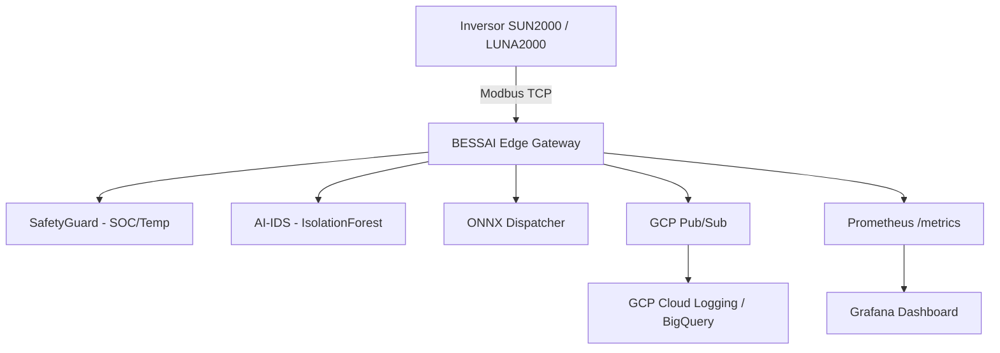

# BESSAI Edge Gateway

> **Open-source industrial BESS gateway** — AI-augmented anomaly detection, NTSyCS-compliant telemetry, and IEC 62443 SL-1 security architecture for battery energy storage systems.

[](https://opensource.org/licenses/Apache-2.0)
[](https://www.python.org/)
[](https://github.com/bess-solutions/open-bess-edge/actions)
[](https://github.com/bess-solutions/open-bess-edge/blob/main/SECURITY.md)
[](compliance/iec62443_mapping.md)
[](compliance/ntscys_compliance.md)

---

## What is BESSAI Edge Gateway?

BESSAI Edge Gateway is a **production-grade, open-source** industrial control system component that:

- 🔌 **Connects** to BESS inverters (Huawei SUN2000 / LUNA2000) via **Modbus TCP**
- 🛡️ **Enforces** real-time safety constraints (SOC limits, temperature thresholds) via `SafetyGuard`
- 🤖 **Detects** anomalies using an ensemble of **IsolationForest + z-score** (AI-IDS)
- 🧠 **Dispatches** ONNX ML model inferences for **optimal energy arbitrage**
- ☁️ **Publishes** telemetry to **GCP Pub/Sub** with full OpenTelemetry observability
- 📊 **Exposes** 22 **Prometheus metrics** + Grafana dashboards



---

## Key Features

=== "Safety-First"
    - Hard limits enforced independently of cloud connectivity
    - Watchdog loop with automatic restart on gateway hang
    - `SafetyGuard.check_safety()` blocks unsafe commands before execution

=== "AI-Powered"
    - `ModbusAnomalyDetector`: IsolationForest + z-score ensemble
    - `ONNXDispatcher`: offline edge inference with safe fallback
    - 6 real-time AI metrics in Prometheus

=== "Standards-Compliant"
    - ✅ IEC 62443-3-3 SL-1 (7 Foundation Requirements)
    - ✅ NTSyCS CEN Chile (Chapter 4, 6, 8)
    - ✅ OpenSSF Best Practices
    - ✅ SBOM (CycloneDX) + cosign image signing

=== "Observable"
    - 22 Prometheus metrics with [12 alert rules](alerting.md)
    - OpenTelemetry traces to GCP Cloud Trace
    - Structured logs via `structlog`

---

## Quick Start

```bash
# Clone
git clone https://github.com/bess-solutions/open-bess-edge.git
cd open-bess-edge

# Configure
cp config/.env.example config/.env
# Edit INVERTER_IP, SITE_ID, GCP_PROJECT_ID

# Run (Docker)
docker compose up bessai-gateway

# Verify
curl http://localhost:8000/health
# → {"status": "healthy", "site_id": "SITE-CL-001", "uptime_s": 12.3}
```

→ See the full [Quick Start guide](quickstart.md)

---

## Architecture

The gateway runs a **single async event loop** with three concurrent tasks:

1. **Modbus polling loop** — reads all registers every cycle (`WATCHDOG_TIMEOUT`)
2. **AI-IDS pipeline** — runs anomaly detection, updates Prometheus metrics
3. **Cloud publisher** — batches and publishes to GCP Pub/Sub

→ See [Architecture Overview](architecture.md) and [ADRs](adr/README.md)

---

## Project Status — v1.4.0

| Component | Status |
|---|---|
| Modbus TCP Driver | ✅ Production |
| SafetyGuard | ✅ Production |
| AI-IDS (IsolationForest + z-score) | ✅ Production |
| ONNX Dispatcher | ✅ Production |
| GCP Pub/Sub Publisher | ✅ Production |
| OpenTelemetry | ✅ Production |
| Prometheus (22 metrics + 12 alerts) | ✅ Production |
| Grafana Dashboards | ✅ Production |
| IEC 62443 SL-1 | ✅ Mapped |
| NTSyCS CEN Chile | ✅ Mapped |
| SBOM + cosign signing | ✅ On every release |
| Test suite | ✅ 372/372 |

---

## Community

- 🐛 **Bug reports:** [GitHub Issues](https://github.com/bess-solutions/open-bess-edge/issues/new?template=bug_report.yml)
- ✨ **Feature requests:** [GitHub Issues](https://github.com/bess-solutions/open-bess-edge/issues/new?template=feature_request.yml)
- 🔒 **Security vulnerabilities:** See [SECURITY.md](https://github.com/bess-solutions/open-bess-edge/blob/main/SECURITY.md)
- 📖 **Contributing:** See [CONTRIBUTING.md](https://github.com/bess-solutions/open-bess-edge/blob/main/CONTRIBUTING.md)
