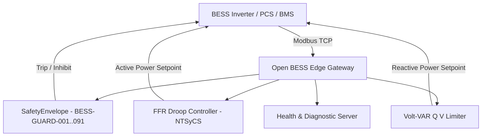

# Open BESS Edge Gateway

> **Deterministic OT Edge Gateway for Battery Energy Storage Systems (BESS)**  
> Fail-closed safety envelope, NTSyCS-compliant Fast Frequency Response (FFR <500 ms), and multi-vendor Modbus TCP integration.

---

## What is Open BESS Edge?

Open BESS Edge is a **deterministic, fail-closed industrial edge gateway** running on substation hardware. It sits directly between battery power conversion systems (PCS / BMS) and upper-layer SCADA / EMS networks.

- 🔌 **Acquires Telemetry** via **Modbus TCP** using vendor-agnostic register profiles (`registry/`).
- 🛡️ **Enforces Fail-Closed Safety** in real-time via `SafetyEnvelope` (`BESS-GUARD-001` through `091`), immediately cutting setpoints to zero on abnormal cell voltages, temperatures, isolation loss, or telemetry staleness.
- ⚡ **Executes Primary Frequency Response (FFR)** with configurable droop and deadband, designed to fulfill NTSyCS requirements with response budgets under 500 ms.
- 🔄 **Provides Reactive Power Control Q(V)** with circular P-Q capability curves and voltage ramp limiters.
- 🧪 **Includes Full In-Tree Physics Simulator** and deterministic harness running over real TCP loopback sockets for automated verification.

```mermaid
graph TD
    A[BESS Inverter / PCS / BMS] -->|Modbus TCP| B[Open BESS Edge Gateway]
    B --> C[SafetyEnvelope - BESS-GUARD-001..091]
    B --> D[FFR Droop Controller - NTSyCS]
    B --> E[Volt-VAR Q V Limiter]
    B --> F[Health & Diagnostic Server]
    C -->|Trip / Inhibit| A
    D -->|Active Power Setpoint| A
    E -->|Reactive Power Setpoint| A
```

---

## Architectural Principles

=== "Fail-Closed Safety"
    - Hard physical limits latched independently of any cloud or supervisor connection.
    - 12 active deterministic safety guards covering cell voltage, string temperature, isolation resistance, and communication timeouts.
    - Any invalid, out-of-range, NaN, or stale telemetry immediately forces setpoints to zero (`SAFE_STATE`).

=== "Deterministic OT Control"
    - Fixed execution loop cycle (default 100 ms) with monotonic clock scheduling.
    - Non-blocking exponential backoff reconnection over TCP without blocking control execution.
    - Absolute separation of critical OT protection from cloud/EMS analytics.

=== "Standards-Aligned"
    - **NTSyCS Cap. 3 & 4 (CEN Chile)**: FFR response within 500 ms, 3.0% droop, ±30 mHz deadband.
    - **SEC RIC N°01/02**: Fail-safe hold upon communication loss.
    - **IEC 62443**: Defense-in-depth OT envelope, least privilege runtime, no cloud dependency for safety.

=== "Fully Testable"
    - Canonical 278-test suite with zero mocks: runs real TCP socket exchanges against a deterministic simulated battery plant.
    - Fuzzing and property-based verification (Hypothesis) covering non-finite inputs and edge boundaries.
    - Anti-overclaiming validator (`scripts/verify_claims.py`) in continuous integration.
