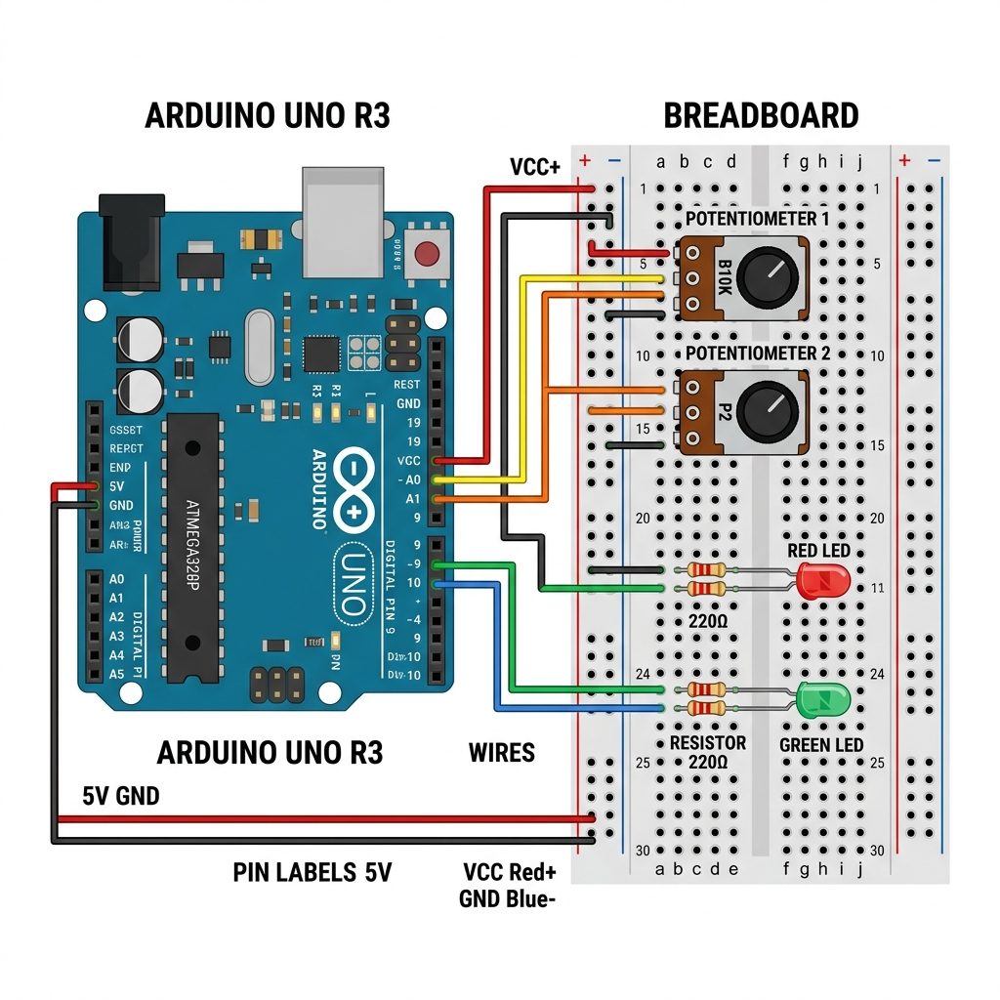

# Diagrama de Cableado (Wiring Diagram) Físico

El proyecto requiere los siguientes periféricos que se deben cablear físicamente en una Placa de Pruebas (Breadboard) o conectados directamente a las patas del SainSmart UNO (Arduino Uno clon).

## Lista de Materiales (BOM)

- 1x SainSmart UNO R3.
- 1x Cable USB tipo impresora.
- 2x Potenciómetros lineales de (10kΩ).
- 2x LEDs de colores o 2x Módulos de Relé 5V de 1 canal.
- 2x Resistencias de protección para LED (220Ω). *Si usas modulo Relé, se omite.*
- Cables (Jumpers) Dupont Macho-Macho de diferentes medidas.

## Instrucciones de Cableado

### 1. El Simulador de Batería (Estado de Carga - SOC)
Utilizaremos un **Potenciómetro**. Esto nos permitirá simular artificialmente cómo la batería "sube y baja" de porcentaje de carga a los ojos del núcleo de IA de BESSAI. Gíralo con tu mano durante una demostración y verás a la inteligencia artificial reaccionar en el dashboard.

- **Pata 1 (VCC)**: Conectar al pin `5V` del SainSmart.
- **Pata 2 (Data / Medio)**: Conectar al pin Analógico `A0`.
- **Pata 3 (GND)**: Conectar a cualquier pin `GND` del SainSmart.

### 2. El Simulador Tálmico (Sensor de Temperatura)
BESSAI detendrá la AI local en su lazo de control Modbus (SafetyGuard) si detecta recalentamiento. Finge este recalentamiento con un segundo circuito giratorio.

- **Pata 1 (VCC)**: Conectar a línea `5V` del Arduino.
- **Pata 2 (Data / Medio)**: Conectar al pin Analógico `A1`.
- **Pata 3 (GND)**: Conectar a la misma línea global `GND`.

### 3. Indicador Comando Carga (Charging State)
Cuando el DRL (Deep Reinforcement Learning Agent) decida cargar energía desde la red local durante precios bajos, iluminará este LED (o cerrará este relé).
- **LED Anodo (Pata larga)**: Pin digital `7` del SainSmart (Con Resistencia de 220Ω en serie).
- **LED Cátodo (Pata corta)**: Línea `GND`. 

### 4. Indicador Comando Descarga (Discharging State)
Cuando el DRL decida descargar y vender energía a Precio Margina (CMg) elevado, activará esta otra luz (o este otro relé que controlará una carga pesada).
- **LED Anodo (Pata larga)**: Pin digital `8` del SainSmart (Con Resistencia de 220Ω en serie).
- **LED Cátodo (Pata corta)**: Línea `GND`. 

### 5. Indicador de Conexión y Lazo Vivo (BESSAI Watchdog Heartbeat)
No es necesario cablear nada extra para esta funcionalidad. BESSAI utiliza el LED integrado en la propia placa del Arduino (marcado con una pequeña letra "L" al lado del chip).
Cuando el software del Gateway inyecta exitosamente el pulso de latido al Servidor Modbus por TCP y FC06 (Escritura simple), el Arduino encenderá y apagará el LED "L" indicando que el Gateway de Inteligencia Artificial está vivo y controlando el circuito.
- **Hardware Integrado**: Pin digital interno `13` (`LED_BUILTIN`).

## Cuidados Operacionales

1. Procura alimentar directamente con el cable USB desde el computador, eso proporcionará energía estándar.
2. No compartas la línea serial de `0 (RX)` y `1 (TX)` en la placa con otros sensores, dado que estas clavijas también son el puerto principal por el que transita nuestra comunicación Modbus RTU hacia el PC local.
